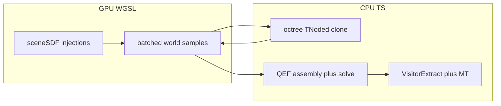

# Iso-simplicial export: sequential agent plan

**Constraints (all agents):** Scene SDF evaluation only in WGSL (same injection pattern as [src/shaders/mdc.wgsl](src/shaders/mdc.wgsl) / [src/shaders/sample_grid.wgsl](src/shaders/sample_grid.wgsl)). TypeScript may assemble QEF linear systems and solve them **from GPU-read scalars/vectors only**—never evaluate the transpiled scene on CPU. Octree topology and mesh traversal stay on CPU (v1). Prefer parity with [docs/reference_impl/isosurf/isosurf](docs/reference_impl/isosurf/isosurf) and [docs/iso_simplicial.md](docs/iso_simplicial.md).

**Integration spine:** New exporter ultimately plugs into [src/render-worker-core.mts](src/render-worker-core.mts) `handleRenderMesh` beside `"mdc"` and `"shrec"` ([ExporterKind](src/render-worker-protocol.mts)). Until Agent 7, exporting can remain internal/Dev Tools–gated.

---

## Agent 1 — Foundations: typed constants + reference parity harness

**Depends on:** Nothing.

**Scope:**

- Port **compile-time tables** needed everywhere: cube edge/face/corner indexing from reference [`cube_arrays`](docs/reference_impl/isosurf/isosurf/cube_arrays.h), [`tet_arrays`](docs/reference_impl/isosurf/isosurf/tet_arrays.cpp/.h) (MT `tet_tris`, `tet_edge2vert`), orientation helpers matching [`traverse.h`](docs/reference_impl/isosurf/isosurf/traverse.h) / [`visitorextract.cpp`](docs/reference_impl/isosurf/isosurf/visitorextract.cpp).
- Add **`IsoSimplicialConstants`** (or similar): `OVERSAMPLE_QEF`, `BORDER`, `DEPTH_MIN` / `DEPTH_MAX`, epsilon shrink for dual domains—single source of truth, documented mapping to reference `#define`s / [`iso_common.h`](docs/reference_impl/isosurf/isosurf/iso_common.h).

**Deliverables:** New module(s) under e.g. `src/export/iso-simplicial/` (exact naming team choice). No GPU yet.

**Handoff:** Constants module + unit tests that tables match reference (spot-check indices against known MT cases).

**Acceptance:** `make build` / `make test` green; tests verify table sizes and a few fixed index lookups.

---

## Agent 2 — GPU batched sampler + shader module

**Depends on:** Agent 1 (constants for future packing only; can stub).

**Scope:**

- New WGSL compute shader (e.g. `src/shaders/iso_sample_batch.wgsl`): input buffer of `vec3f` world positions + count uniform; output `vec4f` per sample = `(nx, ny, nz)` analytical normal from `sceneSDF(p).n` (or normalized gradient) and **`w` = scalar distance `d`** (or match reference sign convention for `changesSign`). Reuse the **same** `//:) insert` pattern and bindings alignment as [sample_grid.wgsl](src/shaders/sample_grid.wgsl) / [mdc.wgsl](src/shaders/mdc.wgsl) so one scene build binds correctly.
- TS wrapper: allocate readback buffers, `ShaderCompiler.compile(...)`, dispatch 1D or 3D workgroups, `copyBufferToBuffer` / map async—mirror patterns in [src/export/grid-sample.mts](src/export/grid-sample.mts) (`GridSampler`) for buffer sizing and cancellation if export is cancelled.

**Handoff:** `IsoSampleBatch.run(device, positions: Float32Array): Promise<{ d: Float32Array, n?: ... }>` (exact layout documented). Document **byte layout** in file header.

**Acceptance:** For a built trivial scene, batch equals point-wise eval from existing path within float tol; `make build` validates WGSL.

---

## Agent 3 — CPU QEF solvers (Hermite → dual vertex)

**Depends on:** Agent 2 output layout (distances + normals); Agent 1 tables.

**Scope:**

- Port **unconstrained + constrained** least-squares minimizers from [`TNode::vertNode`](docs/reference_impl/isosurf/isosurf/iso_method_ours.h) / `vertFace` / `vertEdge`: build normal equations from **arrays of planes** (reference stores `(plane_norms, plane_pts)`), solve **4×4 / 3×3 / 2×2** interiors; then face/edge/corner constrained augmented systems (**reference uses explicit matrix inverse up to ~7×7**).
- Use **`Float64Array`** for accumulation/solves where reference uses `double`, to preserve thresholds like `badqef`.
- Public API: `computeDualVertexCube(samples...)`, `computeDualVertexFace(...)`, `computeDualVertexEdge(...)` returning `vec4` position+value, plus **QEF error** scalar for subdivision.

**No octree yet:** Unit tests with **synthetic planes** and small handcrafted Hermite data; optional golden file from a tiny known cell.

**Handoff:** Pure functions + tests; document exact input ordering (oversample lattice iteration order must match reference for debugging).

**Acceptance:** Unit tests pass; optional numeric comparison to reference on one fixed input vector (if you script reference offline, optional).

---

## Agent 4 — CPU octree build (refinement + GPU batch integration)

**Depends on:** Agents 1–3.

**Scope:**

- Port [`TNode`](docs/reference_impl/isosurf/isosurf/iso_method_ours.h) data layout (verts 8, edges 12, faces 6, node, children) and [`TNode::eval`](docs/reference_impl/isosurf/isosurf/iso_method_ours.cpp) recursion: corner lattice, `changesSign`, `badqef`, min/max depth, `is_outside` prunes.
- **Sampling strategy:** For every `csg_root->eval(...)` in reference, replace with: enqueue world positions → **Agent 2 batch** → scatter results into TS structures. Mid-cell interpolations that reference does analytically on CPU still use **only** interpolated positions then **batch-eval those positions on GPU** (reference lines ~172–193 re-eval midpoints—must stay GPU).
- **Dual vertices:** Call Agent 3 solvers with Hermite data built from batch results.

**Handoff:** `IsoOctree.build(params): IsoOctree` where leaves carry fully populated `verts/edges/faces/node` with final scalar field at dual points (`function(p)` pass = one more batch eval at optimized coordinates).

**Acceptance:** On a small bounded scene + tight depth limits: deterministic node count; sign-change behavior matches reference logic; **grep audit**: no `scene`/`compile` eval in TS for distance.

---

## Agent 5 — CPU extraction: traversal + Marching Tetrahedra

**Depends on:** Agent 4 tree + Agent 1 tables.

**Scope:**

- Port [`traverse.h`](docs/reference_impl/isosurf/isosurf/traverse.h) templates to **explicit TS recursion** (same recursion order as `traverse_node<trav_edge>` + vert callbacks).
- Port [`VisitorExtract`](docs/reference_impl/isosurf/isosurf/visitorextract.cpp): `on_edge` tet construction, `processTet`, `findZero` linear interpolation—**no new SDF calls**; use stored `w` / distance at tet corners only.
- Skip `JOIN_VERTS` / topo edge complexity for v1 unless trivial.

**Handoff:** `extractMesh(tree: IsoOctree): MeshData` (triangles; normals may be face crosses for v1).

**Acceptance:** Same tree snapshot → triangle count within expectation vs reference executable on disk fixture (or internal compare script); no NaNs.

---

## Agent 6 — Phase 5 quality (optional flag): isosurface snap + degeneracy

**Depends on:** Agents 4–5.

**Scope:** Implement paper §4.1-style improvement and degenerate triangle removal per reference [`rootfind.h`](docs/reference_impl/isosurf/isosurf/rootfind.h) usage patterns: **new positions → GPU batch eval only**; iterate with bounded steps; gate behind exporter flag default **off** until stable.

**Acceptance:** With flag off, bitwise same mesh as Agent 5; with flag on, documented behavior on 1–2 scenes.

---

## Agent 7 — Wire-up + UX + docs touchpoints

**Depends on:** Agents 2–5 (6 optional).

**Scope:**

- Extend [`ExporterKind`](src/render-worker-protocol.mts) and [`handleRenderMesh`](src/render-worker-core.mts) branch to invoke new exporter class (parallel structure to [src/export/mdc.mts](src/export/mdc.mts) / [src/export/shrec.mts](src/export/shrec.mts)).
- Dev Tools / app: exporter selector + params (bounds, voxel-ish scale analog if any, depth caps).
- [`AGENTS.md`](AGENTS.md): one paragraph stating iso-simplicial export uses GPU-only SDF and CPU octree/MT.

**Acceptance:** User can export via UI; worker logs timing breakdown similar to other exporters.

---

## Global sequencing rules for agents

1. **Order:** 1 → 2 → 3 → 4 → 5 → (6) → 7. Do not start N+1 until N’s **Acceptance** passes.
2. **Handoff artifact:** Each agent updates a short `README` or `iso-simplicial-handoff.md` in `src/export/iso-simplicial/` with API signatures, buffer layouts, and known gaps—Agent 7 consolidates into AGENTS if desired.
3. **Correctness over perf:** Agent 4 may use **many small batch calls** during recursion; optimize later.
4. **Build discipline:** Per workspace rules, validate with `make build` / `make test` after substantive changes.
