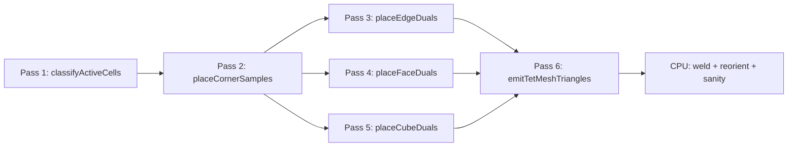

# ISOExport Phase 1 — Uniform-grid simplicial isosurface

## Goal

Validate the simplicial-partition pipeline end-to-end on a uniform grid (every cell is "minimal" by construction), output a topologically manifold mesh, and wire it through the existing exporter plumbing so it can be A/B-tested against `MDCExport`. Sharp-feature recovery, octree adaptivity, and triangulation improvement are out of scope here; they are Phases 2–4.

## Algorithm reduced to the uniform case

When all cells are the same depth, "minimal m-cell" simplifies dramatically:

- Every grid corner is a 0-cell (its dual is the corner itself, value `F(corner)`).
- Every grid edge is a minimal 1-cell — exactly **4 cubes share each interior edge**.
- Every grid face is a minimal 2-cell — exactly **2 cubes share each interior face**.
- Every cube is a minimal 3-cell.

The recursive simplicial decomposition becomes a fixed barycentric subdivision: **48 tets per cube** (12 edges × 4 face-incident-pairs / 1, accounted for once per cube) generated from the four duals (corner, edge, face, cube). Per minimal edge: **16 tets** (4 incident faces × 2 segments × 2 cubes). We dispatch per minimal edge so each tet is generated exactly once with no cross-cube atomics for connectivity.

Passes 3, 4, 5 run independently after Pass 2, so the worker schedules them on a single command encoder.

## File layout

- New: [src/export/iso.mts](src/export/iso.mts) — orchestrator class `ISOExport` modeled on [src/export/mdc.mts](src/export/mdc.mts). Same constructor signature `(helper, params, polygonVerticesBuffer, faceSelectionBuffer, mdcSceneParamsBuffer)`. Returns `Promise<MeshData>`.
- New: [src/shaders/iso.wgsl](src/shaders/iso.wgsl) — six `@compute` entry points listed below. Reuses scene-param bindings 27/28/30 and the `//:) insert sceneSDF{,_mid,_fast}` pattern from [src/shaders/mdc.wgsl](src/shaders/mdc.wgsl).
- Modify: [src/render-worker-core.mts](src/render-worker-core.mts) — extend `handleRenderMesh` to accept an `exporter: "mdc" | "iso"` discriminator (default `"mdc"`), compile the appropriate shader module, and instantiate the matching exporter.
- Modify: [src/render-worker-protocol.mts](src/render-worker-protocol.mts) — add `exporter?: "mdc" | "iso"` to the `renderMesh` message.
- Modify: [src/sdf.mts](src/sdf.mts) — thread `exporter` through `renderMesh()` options and the pending-transpile bookkeeping.
- Modify: [src/app.mts](src/app.mts) — pass `exporter` from dev-tools setting through both call sites of `this.renderer.renderMesh(...)`.
- Modify: [src/components/dev-tools-panel.mts](src/components/dev-tools-panel.mts) and [src/storage/settings.mts](src/storage/settings.mts) — add an `app.meshExporter: "mdc" | "iso"` setting with a small select control.

`compactMesh`/dedup, simplification, and the MDC post-passes (winding fix, crease split, sanity stats) are reused as-is by importing from [src/export/mdc.mts](src/export/mdc.mts) helpers (extracted into a shared `mesh-postprocess.mts` if needed) or by duplicating the small functions for v1.

## Data layout

Same uniform-grid index conventions as MDC: `gridDim{X,Y,Z}` corner counts, cells `gridDim - 1` in each axis. Linearization `idx = x + y*Dx + z*Dx*Dy`.

Per-element global indexers (computed in WGSL helpers):

- Corners: `cornerIdx = idx_xyz`, count `Dx*Dy*Dz`.
- X-edges: `eIdxX = x + y*(Dx-1) + z*(Dx-1)*Dy`, count `(Dx-1)*Dy*Dz`. Y/Z analogous. Edge buffer is the concatenation `[X | Y | Z]` with two prefix offsets stored in uniforms.
- XY-faces (normal Z): `fIdxXY = x + y*(Dx-1) + z*(Dx-1)*(Dy-1)`, count `(Dx-1)*(Dy-1)*Dz`. YZ/XZ analogous. Face buffer is `[XY | YZ | XZ]`.
- Cubes: `cellIdx = x + y*(Dx-1) + z*(Dx-1)*(Dy-1)`, count `(Dx-1)*(Dy-1)*(Dz-1)`.

Each dual entry is `struct DualVertex { pos: vec3f, fval: f32 }` — 16-byte stride. Total budget at 100³ corners: corner ~16 MB, edges ~48 MB, faces ~48 MB, cubes ~16 MB ≈ 128 MB. Well within `maxBufferSize`. We do not subset to active cells in Phase 1 (keeps indexing trivial); inactive duals are simply unused by Pass 6.

## WGSL passes ([src/shaders/iso.wgsl](src/shaders/iso.wgsl))

All six pipelines live in one shader module; the host picks them by entry-point name.

### Pass 1 — `classifyActiveCells_Pass1`

Bit-packed active-cell flags, identical structure to `cellClassification_Pass1` in [src/shaders/mdc.wgsl](src/shaders/mdc.wgsl) (lines 546–603). Active = "any sign change among 8 corners" using `resolveSignAtPos` lifted from `mdc.wgsl` (lines 273–289). Output: `activeCellFlags: array<u32>`. Used only by Pass 6 to skip empty cubes; dual-placement passes ignore it for v1 simplicity.

### Pass 2 — `placeCornerSamples_Pass2`

One thread per grid corner. Writes `cornerDuals[cornerIdx] = DualVertex(worldPos, sceneSDF_fast(worldPos).d - iso)`. Dispatch is 1D over `Dx*Dy*Dz / 64`.

### Pass 3 — `placeEdgeDuals_Pass3`

One thread per edge (3 sub-dispatches, one per axis, with axis offset baked into the uniform `mdcU0`-style packing). For each edge:

- Load both endpoint values from `cornerDuals`.
- If sign change: place dual at the linear iso-crossing along the edge, value `0` (Phase 1 simplification — proper Lindstrom 2D QEF deferred to Phase 4).
- Else: midpoint of the edge with `F(midpoint)` from `sceneSDF_fast`.

Box-clamp `t ∈ [eps, 1-eps]` so the dual is strictly interior. `eps = uniforms.mdcF0.x` (reuse the existing tuning slot).

### Pass 4 — `placeFaceDuals_Pass4`

One thread per face. For each face:

- Sample `F` at face center via `sceneSDF_fast`.
- If center sign differs from any of the 4 corner signs (i.e. iso passes through), do 1 step of gradient-descent toward the iso surface using `sceneSDF_mid`'s analytic normal `n` (clamped to face plane via `n - dot(n, faceNormal)*faceNormal`), bisected once for stability. Otherwise keep the center.
- Box-clamp `(u, v) ∈ [eps, 1-eps]²`.

Output: `faceDuals[fIdx] = DualVertex(pos, F(pos))`. Phase 4 will replace this with a proper 3D constrained QEF in (u, v, F).

### Pass 5 — `placeCubeDuals_Pass5`

One thread per cube. For active cubes, lift the existing 3D QEF directly:

- Walk the 12 cube edges. Each edge with a sign change contributes a `(p, n)` plane sample where `p` is the linear iso-crossing and `n` is `sceneSDF_mid(p).n`.
- Build ATA / ATb / massPoint exactly as in `vertexGeneration_Pass4` of [src/shaders/mdc.wgsl](src/shaders/mdc.wgsl).
- Solve via `solveQEF` (lifted) → clamp to cube AABB scaled by `(1 - eps)`.
- For inactive cubes, place at cube center with `F(center)` (used by tets that span the active boundary).

Output: `cubeDuals[cellIdx] = DualVertex(pos, F(pos))`. Phase 4 will move to 4D QEF (positions + value).

### Pass 6 — `emitTetMeshTriangles_Pass6`

**One workgroup per axis-aligned edge group, one thread per minimal edge.** Per edge:

1. Skip if neither endpoint nor the edge dual span a sign change (cheap rejection — load 2 corner signs + edge dual sign).
2. Resolve the 4 incident cubes (`cellIdx` for each quadrant; clamp to grid). Resolve the 4 incident faces.
3. For each of the 4 face-incident-pairs (one per face, identifying the 2 cubes sharing that face that also touch the edge):
    - Build the two segments `(corner_a → edgeDual)` and `(corner_b → edgeDual)`.
    - For each cube of the pair, build 2 tets: `(corner_a, edgeDual, faceDual, cubeDual)` and `(corner_b, edgeDual, faceDual, cubeDual)` → 4 tets per pair → 16 tets per minimal edge.
4. For each tet, sign-classify the 4 dual values against `iso = 0` (we already shifted by `iso` when storing `fval`). Look up the **16-entry MT table** baked as a `const` in WGSL. The table emits 0, 1, or 2 triangles, with each triangle expressed as 3 (tetEdgeIdx) entries.
5. For each emitted triangle, for each of its 3 vertices: linearly interpolate `mix(p_i, p_j, F_i / (F_i - F_j))` along the named tet edge using the tet's stored dual positions.
6. Atomic-append: reserve `3` indices via `atomicAdd(&indexCount, 3u)`, write 3 interpolated positions to `vertices[]`, write the 3 indices to `indices[]`. Phase 1 emits **non-deduplicated** vertices (one set per triangle); CPU welds in post-process.

Topology is correct by construction: every interior tet face is shared by exactly two tets (paper Section 4), so every interior mesh edge is shared by exactly two emitted triangles, regardless of vertex deduplication.

Maximum triangle budget: `numActiveEdges * 16 * 2`. Use a generous upper bound `numActiveCells * 96` (≈ 16× MDC's `* 6`). Allocate via `createBuffer(..., COPY_SRC | STORAGE)`. Atomic counter clamps writes to capacity.

### Reused / lifted helpers from [src/shaders/mdc.wgsl](src/shaders/mdc.wgsl)

`resolveSignAtPos`, `findEdgeIntersection`, `solveCholesky`, `solveQEF`, `qefCost`, `gridPosToWorldPos`, `gridIndexTo3D`, `gridPosToIndex`, `safeUnit3`, `mix3f`, `isCancelled`. Either move to a new shared `iso_mdc_common.wgsl` and `//:) include` from both, or duplicate for v1 (smaller blast radius). I recommend duplication for Phase 1, then refactor when Phases 2–4 land.

## Orchestrator ([src/export/iso.mts](src/export/iso.mts))

Mirrors `MDCExport` structure (constructor, `#destroyLocalBuffers`, `export(shaderModule, progressCallback)`):

1. Build uniform buffer (same layout idea as MDC's 112-byte struct, plus two `u32` slots for the X/Y edge prefix offsets and the X/Y face prefix offsets).
2. Allocate corner / edge / face / cube dual buffers + `activeCellFlags`.
3. Pass 1 dispatch (active-cell flags, no readback needed in Phase 1 — drive Pass 6 by the flags buffer directly).
4. Pass 2 dispatch (corners). Single command encoder, `await onSubmittedWorkDone()`.
5. Passes 3, 4, 5 batched into one encoder (independent).
6. Pass 6 dispatch (tet emission, atomic indices). Use 2D dispatch fallback for `>65535` workgroups, same pattern as MDC.
7. Read back vertex/index buffers.
8. **CPU weld**: hash interpolated positions quantized to `voxelSize * 1e-4` precision into a `Map<bigint, u32>`, build remap, compact `verts` + rewrite `tris`. This dedups shared MT crossings into a single mesh vertex and is what makes the manifold property visible to downstream code.
9. Compute per-vertex normals from `sceneSDF_mid(pos).n` via a small extra GPU pass (or on CPU after weld — Phase 1 can do it on CPU using the worker `scene.compileMid()` is GPU-only, so do it on the GPU with a tiny `normalize_Pass7` kernel that takes welded positions in / writes normals out, OR skip and use face-averaged normals from the MDC crease-split path). **Decision for Phase 1: face-averaged normals via the existing `splitCreaseVertices` flow** — no new GPU pass needed, and matches what MDC does today.
10. Reuse MDC's winding-orientation BFS, `splitCreaseVertices`, and sanity-stats blocks from [src/export/mdc.mts](src/export/mdc.mts).
11. Optional simplification through `simplifyMesh` (same `simplifyOnExport` knob).

Cancellation: same `cancelled` storage buffer pattern as MDC, polled in TS between passes via `progressCallback?.cancelled`.

## Wiring & UI

- `MainToWorkerMessage["renderMesh"]` in [src/render-worker-protocol.mts](src/render-worker-protocol.mts) gains `exporter?: "mdc" | "iso"`.
- `RenderWorkerCore.handleRenderMesh` selects the shader / exporter; new `import isoShader from "./shaders/iso.wgsl"` and `import { ISOExport } from "./export/iso.mjs"`. The `ShaderCompiler` chain is identical (same scene aux/SDF inserts).
- [src/sdf.mts](src/sdf.mts) `renderMesh(src, documentName, options)` extends `options` with `exporter`. Pending-transpile entries store the choice and pass it through on `transpileResult`.
- [src/app.mts](src/app.mts) reads `devTools.meshExporter` at both call sites (around lines 1422 and 1497) and forwards it.
- Dev tools setting (default `"mdc"`): add `meshExporter` BehaviorSubject + a `<select>` next to the existing `Mesh Simplify on Export` checkbox in [src/components/dev-tools-panel.mts](src/components/dev-tools-panel.mts), persisted via `Settings.updateGlobal({ app: { meshExporter: v } })` in [src/storage/settings.mts](src/storage/settings.mts).

## Validation

1. `make build` — must compile the new WGSL with the `//:) insert` injection working.
2. Manual test scenes (compare ISO vs MDC at the same `voxelSize`, both with `simplifyOnExport: false`):
    - Sphere — both should produce manifold spheres; ISO triangle count will be higher (expected ≈ 2× without Phase 3 improvement).
    - Cube — sharp edges look chamfered with Phase 1 (no 4D QEF yet); validate manifoldness, not feature fidelity.
    - Threaded rod — validate that thin threads don't tear; note feature crispness deficit (deferred to Phase 4).
    - CSG difference of two spheres (lens) — paper's Fig 3 case.
3. **Manifold sanity**: the existing `MDC mesh stats` block in [src/export/mdc.mts](src/export/mdc.mts) (lines 843–895) reports `boundaryEdges` and `nonManifoldEdges`. Lift that block into the shared post-process and assert ISO produces `boundaryEdges == 0` and `nonManifoldEdges == 0` on closed scenes. **This is the key acceptance test** for Phase 1.
4. Log timing per pass via `dbgLog("IsoExport").debug(...)` with the same fmt as `logDiag` in MDC; record GPU buffer/readback estimates so we can compare with MDC's diagnostics.

## Out of scope (deferred to later phases)

- Octree adaptive refinement (Phase 2): everything here assumes uniform grid.
- Triangulation improvement + topology safety test (Phase 3): cube/face/edge dual moving onto isosurface with Union-Find, ring-count, sign-pair checks.
- 4D QEF for sharp-feature recovery (Phase 4): edge / face / cube duals using `(pos, F)` Lindstrom minimization with projected gradients.
- Sharing helpers between [src/shaders/mdc.wgsl](src/shaders/mdc.wgsl) and [src/shaders/iso.wgsl](src/shaders/iso.wgsl) via include refactor (after Phase 4 stabilizes the shared surface).

## Risks specific to Phase 1

- **No sharp features** with simple dual placement — visually obvious on cubes/flats. This is expected; document it in the dev-tools dropdown ("ISO (Phase 1, smooth)").
- **Vertex count higher than MDC** — barycentric tetrahedralization is intrinsically dense; Phase 3 improvement reduces ~3×.
- **Atomic index counter contention** in Pass 6 — same hot path as MDC Pass 5, expected to be acceptable. If contention is measurable, fall back to per-workgroup local accumulation + single global atomic at the end.
- **Storage buffer count in Pass 6** — uniforms, activeCellFlags, cornerDuals, edgeDuals, faceDuals, cubeDuals, vertices, indices, indexCount, scene-params, polygon-vertices, faceSelection (uniform), cancelled = ~12 storage bindings. Need to check against `maxStorageBuffersPerShaderStage` (10 by default in WebGPU). Mitigation: pack `cornerDuals + edgeDuals + faceDuals + cubeDuals` into a **single** storage buffer with three u32 base offsets in uniforms (mirrors MDC's `mdcU0.z` activeCellCount packing). This brings Pass 6 to ~9 storage bindings.
