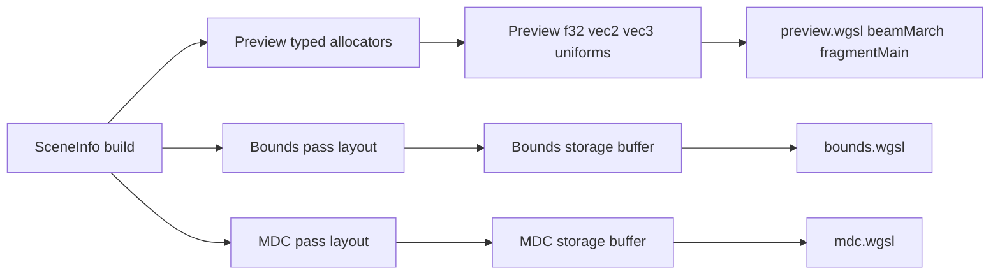

# Preview Uniform Pass Split

## Goal

Refactor parameter plumbing so preview/beam no longer read hot scene data from a shared storage-backed `sceneParams` array. Instead:

- Preview/beam use **preview-only typed uniform banks** (`f32`, `vec2f`, `vec3f`) optimized for hot ray-march reads.
- Bounds and MDC get **their own pass-specific parameter storage**, no longer sharing preview’s layout or buffer.
- **BVH bounds are explicitly out of scope** for this slice.

## Current Pressure Points

- Preview and beam currently read a shared storage buffer via `[src/shaders/preview.wgsl](/Users/matt/galacticad3/src/shaders/preview.wgsl)` and `[src/shaders/scene_params_read.wgsl](/Users/matt/galacticad3/src/shaders/scene_params_read.wgsl)`:

```93:94:src/shaders/preview.wgsl
@group(0) @binding(19) var<storage, read> sceneParams: array<f32>;
//:) include "scene_params_read.wgsl"
```

- Node codegen is built around one flat scalar address space from `[src/scene/scene.mts](/Users/matt/galacticad3/src/scene/scene.mts)`:

```74:80:src/scene/scene.mts
packSceneParams(): Float32Array {
    const out = new Float32Array(this.#sceneParamFloatUsed)
    for (const node of this.getAllNodes()) {
        if (node.paramCount > 0) {
            node.writeSceneParams(out.subarray(node.paramOffset, node.paramOffset + node.paramCount))
        }
```

- Representative preview codegen like `[src/scene/primitives/sphere.mts](/Users/matt/galacticad3/src/scene/primitives/sphere.mts)` emits `spVec3Wgsl(o)` / `spF32Wgsl(o + 3)`, which is convenient but forces hot-loop storage fetches.

## Proposed Architecture



## Implementation Plan

### 1. Introduce pass-specific parameter allocators

Create a new scene-parameter abstraction layer that allocates by **pass** instead of one global flat buffer.

Files:

- `[src/scene/scene.mts](/Users/matt/galacticad3/src/scene/scene.mts)`
- `[src/scene/base.mts](/Users/matt/galacticad3/src/scene/base.mts)`
- new helper file near `[src/scene/scene-params.mts](/Users/matt/galacticad3/src/scene/scene-params.mts)`

Design:

- Keep preview allocator separate from bounds/MDC allocators.
- Preview allocator exposes typed bank reservations such as:
    - `allocPreviewF32(count)`
    - `allocPreviewVec2(count)`
    - `allocPreviewVec3(count)`
- Bounds and MDC can each keep a simpler pass-local storage layout initially.
- Add per-node metadata for preview bank indices instead of reusing one `paramOffset` integer for all passes.

### 2. Add preview-only typed uniform banks

Update preview/beam bindings so hot scene data comes from uniform buffers rather than storage.

Files:

- `[src/shaders/preview.wgsl](/Users/matt/galacticad3/src/shaders/preview.wgsl)`
- `[src/shaders/beam.wgsl](/Users/matt/galacticad3/src/shaders/beam.wgsl)` as reference only if you want parity documentation
- new preview-specific helper include replacing shared scalar helpers
- `[src/render-worker-core.mts](/Users/matt/galacticad3/src/render-worker-core.mts)`

Design:

- Replace preview’s single `sceneParams` binding with multiple uniforms, e.g.
    - `previewParamsF32`
    - `previewParamsVec2`
    - `previewParamsVec3`
- Keep preview and beam on the same shader module/layout, so both entry points see the same preview uniform banks.
- Use intentionally padded layouts (`array<f32>` / `array<vec2f>` / `array<vec4f>` carrying vec3 payloads if needed) if that simplifies alignment and reduces fetch count.
- Query `device.limits.maxUniformBufferBindingSize` at init. The WebGPU **minimum** is **64 KiB per uniform binding** (not “64 KiB total across all banks”). With three separate bindings (`f32`, `vec2`, `vec3`), you can use **up to ~192 KiB** of uniform-backed preview data if the adapter allows it on each binding—still align expectations with real devices.
- Prefer `**array<vec4f>` for “vec3” payloads (w unused or 0) if WGSL uniform alignment for `vec3`/`array<vec3f>` proves awkward; fewer surprises than per-element padding bugs.

### 3. Replace preview codegen helpers with typed-bank reads

Stop emitting preview reads through flat `sp_f32(offset)` / `sp_vec3(offset)` for migrated preview nodes.

Files:

- `[src/scene/scene-params.mts](/Users/matt/galacticad3/src/scene/scene-params.mts)`
- representative nodes in `[src/scene/primitives](/Users/matt/galacticad3/src/scene/primitives)` and `[src/scene/operators](/Users/matt/galacticad3/src/scene/operators)`

Design:

- Add preview helper emitters like `ppF32Wgsl(slot)`, `ppVec2Wgsl(slot)`, `ppVec3Wgsl(slot)`.
- Update node build/pack/codegen to target the right preview bank per field.
- Migrate common hot nodes first:
    - sphere
    - box
    - cylinder/cone/disc if they fit naturally
    - smooth-union params (`radius`, `n`) as preview `f32`
- **Outliers:** nodes that are not expressible as only `f32`/`vec2`/`vec3` in a clean way (notably `**Rotate` with `mat3x3` / 18 f32**) need an explicit rule: e.g. a `**previewParamsF32`extended region** for raw scalars/matrices, or a dedicated small “matrix bank” uniform—do not silently force them into`vec3` banks.
- Keep node ownership explicit: preview packing methods should write into the matching typed bank arrays, not reconstruct from one flat float stream.

### 3b. Phased migration (recommended)

To avoid a single huge PR:

- **Option A — Dual path for one release:** preview shader reads **both** legacy `sceneParams` storage (unmigrated nodes) **and** the new typed uniforms (migrated nodes). CPU packs both until migration is complete. Then delete storage from preview.
- **Option B — Big-bang per vertical slice:** migrate every node type used by `sceneSDF_fast` / `beamMarch` in one go for a subset of scenes.

**Option A** is usually safer for incremental `make build` and manual QA.

### 4. Split non-preview passes from preview storage

Decouple bounds and MDC from preview’s new uniform layout.

Files:

- `[src/shaders/bounds.wgsl](/Users/matt/galacticad3/src/shaders/bounds.wgsl)`
- `[src/shaders/mdc.wgsl](/Users/matt/galacticad3/src/shaders/mdc.wgsl)`
- `[src/export/mdc.mts](/Users/matt/galacticad3/src/export/mdc.mts)`
- `[src/render-worker-core.mts](/Users/matt/galacticad3/src/render-worker-core.mts)`

Design:

- Bounds gets its own pass-local storage buffer/bindings.
- MDC gets its own pass-local storage buffer/bindings.
- Both may continue using a flat storage representation initially, since frame-time is not the driving constraint there.
- Keep their WGSL helper includes pass-specific so preview no longer dictates the shared `sceneParams` contract.

### 5. Update worker buffer ownership and uploads by pass

Make `RenderWorkerCore` own separate GPU resources for preview, bounds, and MDC parameter data.

Files:

- `[src/render-worker-core.mts](/Users/matt/galacticad3/src/render-worker-core.mts)`
- `[src/render-worker-protocol.mts](/Users/matt/galacticad3/src/render-worker-protocol.mts)`
- `[src/interaction/push-pull.mts](/Users/matt/galacticad3/src/interaction/push-pull.mts)`
- `[src/sdf.mts](/Users/matt/galacticad3/src/sdf.mts)`

Design:

- Preview uploads write the typed uniform banks.
- Bounds/MDC uploads write their own storage buffers only when those passes need refresh.
- Push/pull partial writes should target the preview bank/resource for preview rendering, not a shared pass-global buffer.
    - **Critical — uniform write alignment:** WebGPU requires `queue.writeBuffer` **destination offsets into `UNIFORM` buffers to be multiples of 256 bytes**. That conflicts with today’s storage-backed model where cap fields use **arbitrary per-node byte offsets** (dense packing). You cannot replace that with “write 8 bytes at `paramOffset`” into a large uniform array without one of:
        - **Full uniform reupload** on each push/pull tick (small enough `previewParamsF32` that this is acceptable), or
        - **Keep a tiny `var<storage>` (or separate uniform block at offset 0)** for the few mutable cap scalars mid-drag, while static params live in typed uniforms, or
        - **256-byte–aligned slots** per node (simple but sparse/wasteful).
    - Pick one strategy explicitly before coding push/pull; do not assume storage-style partial writes carry over unchanged.
    - Update `[src/interaction/push-pull.mts](/Users/matt/galacticad3/src/interaction/push-pull.mts)` and `[src/render-worker-protocol.mts](/Users/matt/galacticad3/src/render-worker-protocol.mts)` once the target buffer and alignment story is fixed.
- **SerializedNode / main thread:** today `paramOffset` is a scalar index into the packed f32 stream. After the split, the worker may need to expose **preview-specific indices** (per bank) or a stable `previewParamKey` for push/pull; spell this out when serializing so the main thread does not guess wrong offsets.
- **Structural fingerprint:** if preview packing shape changes (bank counts, slot counts), include a **preview-layout version** or extend existing `paramCount`-style markers so param-only rebuilds never pair a new shader with stale uniform packing.
- Preserve the existing pipeline-swap ordering guarantee in `[src/render-worker-core.mts](/Users/matt/galacticad3/src/render-worker-core.mts)`.

### 6. Keep migration scope tight

For this plan, explicitly defer:

- BVH bound representation changes
- attempts to preserve one cross-pass parameter ABI
- dense scalar packing as an optimization goal

## Validation

- `make build`
- Stress-test preview with a heavy scene like `[src/scene/samples/mechwarrior.gcad](/Users/matt/galacticad3/src/scene/samples/mechwarrior.gcad)`
- Compare preview FPS before/after on hot simple-shape scenes
- Verify param-only edits still avoid preview shader recompilation where intended
- Verify MDC export and bounds still produce correct results using their own pass-local storage

## Key Risks

- Current node codegen is deeply coupled to a single scalar offset model; migrating preview to typed banks will require systematic per-node updates.
- Preview and beam share one shader module/layout, so preview binding changes must remain beam-compatible.
- Some nodes do not fit neatly into only `f32` / `vec2f` / `vec3f`; those need either a preview fallback bank or explicit exclusion from the first migration slice.
- **Binding budget:** preview + beam bind groups already carry many resources; adding 2–3 uniform buffers increases layout complexity—verify `maxBindGroups` / per-group binding counts and keep `layout: "auto"` pipeline creation happy.
- **Documentation:** when implementation lands, update `[AGENTS.md](/Users/matt/galacticad3/AGENTS.md)` to describe **preview vs bounds vs MDC** parameter storage (parity across passes is no longer a goal for this refactor).
