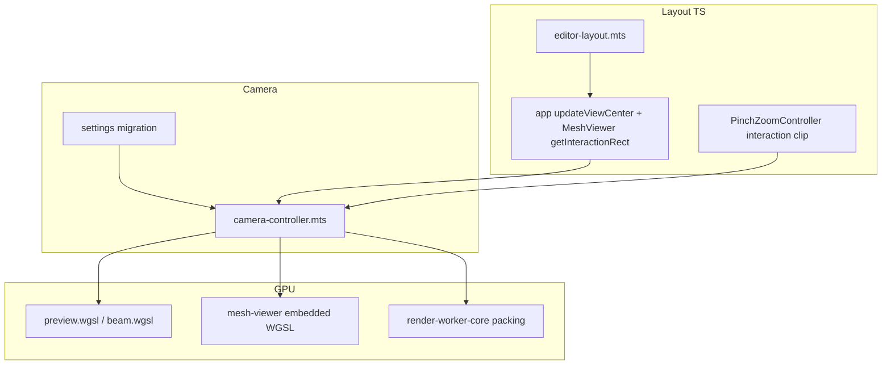

# Logical viewports + dolly zoom

## Current state (baseline)

- **[`src/layout/editor-layout.mts`](src/layout/editor-layout.mts)** already defines `visiblePreviewRegion(canvasRect, mainPanelsRect, editorOnLeft, frac)` and `viewCenterUv(canvasRect, visibleRegion)`. This matches [`preview.wgsl`](src/shaders/preview.wgsl) `camera.viewCenter` shifting (`fragCoord`-based UV → `uvAspect`).
- **[`src/app.mts`](src/app.mts)** passes **`getVisiblePreviewRect`** (preview canvas only) into [`SDFRenderer`](src/sdf.mts), which uses it for `#screenToClickUV` clipping and [`CameraController`](src/controls/camera-controller.mts) pointer/trackball bounds.
- **Bug / gap**: `#setupLayoutObservers` `updateViewCenter` computes UV from the **preview** canvas only, then calls **`this.#mesh?.setViewCenter(u, v)` with the same pair**. When the mesh panel sits in a different flex slot (different [`DOMRect`](https://developer.mozilla.org/en-US/docs/Web/API/DOMRect)), its visible region center **does not** match the preview’s — editor-on-top is the clearest case (preview is upper strip, mesh lower strip).
- **[`MeshViewer`](src/components/mesh-viewer.mts)** is constructed **without** `getInteractionRect` ([`#setMeshViewerEnabled`](src/app.mts) comment explains the old workaround). Trackball then uses the **full mesh canvas** ([`trackball.mts`](src/controls/trackball.mts) falls back to `scene.getBoundingClientRect()`), so interaction does not respect the editor overlay on that panel.
- **[`PinchZoomController`](src/controls/pinchzoom-controller.mts)** listens on the host element for `wheel` / touch but **does not** clip to the logical viewport — wheel over the canvas still fires even when the cursor is over the overlapped “dead” strip if events hit the canvas underneath (stacking/z-order dependent).

---

## Part A — Logical viewport per surface (preview + mesh)

### A1. Shared helpers

- Keep using **`mainPanels.getBoundingClientRect()`** + **`getEditorLayout(mainPanels)`** + **`visiblePreviewRegion`** per **each** host canvas:
    - `regionPreview = visiblePreviewRegion(previewCanvasRect, mainRect, …)`
    - `regionMesh = visiblePreviewRegion(meshCanvasRect, mainRect, …)` when `#mesh` exists.
- Add small wrappers if useful (e.g. `logicalViewportForCanvas(canvas: HTMLElement): DOMRect`) to avoid duplicating the three-call sequence in [`app.mts`](src/app.mts).

### A2. `updateViewCenter` — independent UV per viewer

In [`app.mts`](src/app.mts) `updateViewCenter`:

- Compute `{ u, v }` from **`viewCenterUv(previewCanvasRect, regionPreview)`** → `renderer.setViewCenter(u, v, editorOffsetPx)` (unchanged offset helper).
- If `#mesh` exists: compute **`viewCenterUv(meshCanvasRect, regionMesh)`** and pass **that** to `mesh.setViewCenter(uMesh, vMesh)` — **do not** reuse preview UV.

### A3. `getInteractionRect` for mesh

- When creating `MeshViewer`, pass a closure mirroring preview: **`() => visiblePreviewRegion(meshViewer.canvas.getBoundingClientRect(), mainPanels.getBoundingClientRect(), layout.editorOnLeft, layout.frac)`** (read layout the same way as today).
- Ensures [`CameraController`](src/controls/camera-controller.mts) `#isClientInInteractionRect`, click/dblclick/hover gating, and [`Trackball`](src/controls/trackball.mts) arcball `box` match the **visible** mesh area.

### A4. Wheel / pinch inside logical viewport

- Extend [`PinchZoomController`](src/controls/pinchzoom-controller.mts) (or wrap at call site) so **`wheel` / pinch** applies zoom **only** when `clientX/Y` lie inside an optional **`getInteractionRect`** (same semantics as pointer checks). Prevents scrolling the “dolly” when the wheel target is outside the visible region but still over the element.

### A5. Screen-space consumers audit

Walk call sites that assume “full canvas” for **interaction** or **chrome placement**:

- **[`SDFRenderer`](src/sdf.mts)** `#screenToClickUV` — already clips picks to interaction rect; **UV** must remain **full-canvas normalized** to match WGSL `fragCoord` + `viewCenter` (no change to formula beyond keeping rects consistent).
- **[`PushPullController`](src/interaction/push-pull.mts)** `worldPerPixel` — today `(2 * zoom) / canvasHeight` using full canvas height; after dolly (Part B), revisit to use the **same effective ortho extent** the shader uses (see below). Likely still **full canvas pixel height** if `camera.res` stays full framebuffer — verify after Part B.

### A6. Flex / DevTools caveat

[`#viewports`](src/index.css) stacks `preview-window`, [`DevToolsPanel`](src/components/dev-tools-panel.mts) (often `display: none`), and `mesh-viewer`. Confirm in QA that when DevTools is **shown**, flex shares space as intended; only adjust CSS/order if it breaks the “half viewport each” expectation.

---

## Part B — Dolly zoom (replace ortho-scale `zoom` as the primary control)

### B1. Conceptual model

Today **`camera.zoom`** in WGSL is **orthographic half-height** (see [`preview.wgsl`](src/shaders/preview.wgsl) `wppu`, `computeRayOrigin`, [`beam.wgsl`](src/shaders/beam.wgsl)); [`CameraController`](src/controls/camera-controller.mts) couples wheel zoom to **`#applyZoomToCursor`** against that scalar, and [`#computeCameraPosition`](src/controls/camera-controller.mts) intentionally keeps eye offset **decoupled** from zoom (“Coupling zoom to this offset breaks…”).

Target behavior: **wheel zoom moves the camera along the view axis (dolly)** toward/away from the orbit pivot (or focus), so “zoomed in” means **physically closer**, not only shrinking `zoom`. Orbiting/panning should **stop** treating changing `zoom` as the primary signal for sensitivity ([`PAN_ZOOM_REF`](src/controls/camera-controller.mts), [`pinchzoom-controller`](src/controls/pinchzoom-controller.mts) `zoomDeltaScale`).

**Implementation approach (recommended for minimal WGSL churn):**

1. Introduce a **dolly distance** (or derive from translation along camera forward after pivot). Persist it in [`CameraSettings`](src/storage/settings.mts) (either replace `zoom` or add `dollyDistance` + migrate old saves).
2. Keep a **fixed orthographic half-extent at the ray origin slab** (either constant or slowly varying), **or** set `effectiveOrthoHalf = refHalf * (refDistance / distance)` so screen magnification tracks dolly — choose one consistent rule and document it in [`AGENTS.md`](AGENTS.md) / code comments.
3. **`#applyZoomToCursor`**: rewrite from delta in **`zoom`** to delta in **distance**, translating `#cameraTranslation` so the world point under the cursor stays fixed (same goal as today, new Jacobian).
4. **Focus / Cmd+dblclick paths** ([`recenterOnPoint`](src/controls/camera-controller.mts), [`setPivotToWorldHit`](src/controls/camera-controller.mts)): re-validate distance preservation vs [`PREVIEW_RAY_ORIGIN_DEPTH`](src/controls/camera-controller.mts) / [`RAY_ORIGIN_DEPTH`](src/shaders/preview.wgsl) — these paths assumed ortho-scale zoom.

### B2. Shader + worker

- **[`preview.wgsl`](src/shaders/preview.wgsl)** / **[`beam.wgsl`](src/shaders/beam.wgsl)**: replace usage of `camera.zoom` as “user zoom” with uniforms that reflect the new model (`dolly` + fixed `orthoHalf` or combined `effectiveHalf`). Update **every** site listed by repo search (`computeRayOrigin`, beam offsets, `wppu`, tile math).
- **[`render-worker-core.mts`](src/render-worker-core.mts)** / protocol ([`render-worker-protocol.mts`](src/render-worker-protocol.mts)): pack the new fields into the camera uniform blob consistently with TS.

### B3. Mesh viewer parity

[`mesh-viewer.mts`](src/components/mesh-viewer.mts) embeds WGSL that maps scene vertices with **`camera.zoom`** orthographic division (~lines 1429–1433). Update to the **same** projection rule as the preview so raster stays aligned when [`applyState`](src/controls/camera-controller.mts) syncs both controllers ([`app.mts`](src/app.mts) `#setMeshViewerEnabled`).

### B4. Dependent TS math

- **[`push-pull.mts`](src/interaction/push-pull.mts)** `worldPerPixel` — tie to the **effective** ortho half-height used in preview (after B1).
- **[`pinchzoom-controller.mts`](src/controls/pinchzoom-controller.mts)** — scale wheel deltas by **distance** instead of old `zoom` scalar if needed for feel.
- **[`SettingsManager`](src/storage/settings.mts)** — migration: map legacy saved `zoom` to initial `dollyDistance` / `orthoHalf` so documents don’t reset cameras.

---

## Part C — Verification

- **`make build`** / **`make test`** — required after WGSL + protocol changes.
- Manual QA matrix (user-led): editor left vs top; mesh viewer off vs on (stacked); wheel zoom / pinch / pan / orbit / pick / push-pull / camera presets; confirm preview and mesh stay matched via existing `change$` sync.

---

## Dependency graph

---

## Risk notes

- **Orthographic dolly vs pure translation**: Moving only `camera.position` along parallel rays **without** changing ortho extent does **not** magnify the image in classical ortho. The implementation must either couple extent to distance (similar triangles) or move to **perspective** rays — the plan explicitly records choosing one rule in **B1** and applying it consistently in preview + mesh + push-pull.
- **MAX_DIST / RAY_ORIGIN_DEPTH**: Changing distance may require retuning [`preview.wgsl`](src/shaders/preview.wgsl) constants so the ray march still brackets the scene.
