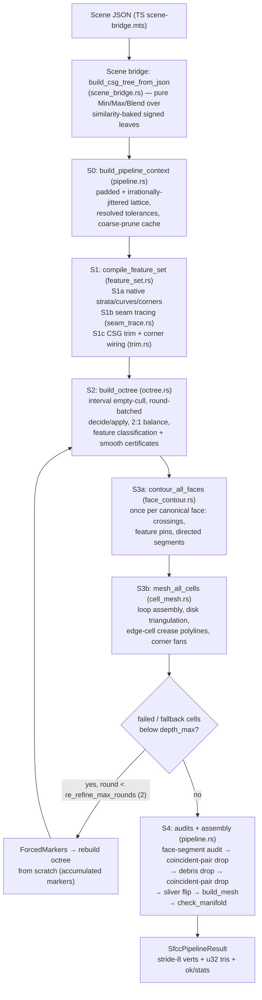

# SFCC Meshing Algorithm

**SFCC — Stratified Feature-Conforming Contouring** — is the Rust meshing kernel (`gcad-wasm/kernel/src/sfcc/`) that converts an implicit CSG scene (a signed-distance-field tree plus an axis-aligned world cube) into a feature-conforming triangle mesh with explicit validation diagnostics. It is the default exporter; the app also has other export paths.

This document describes the algorithm **as implemented**, verified claim-by-claim against the code. It supersedes the older design documents (`docs/research/sfcc-algorithm-design.md`, `docs/research/sfcc-spatial-partition-meshing.md`); every place those documents (or stale in-code comments) disagree with the implementation is catalogued in the final section.

Audience: developers familiar with isosurface extraction (marching cubes, dual contouring) but new to this codebase.

---

## 1. Overview

SFCC is a **primal, face-sharing contouring method in the CMS (cubical marching squares) family**, with three distinguishing ideas:

1. **Symbolic features, not sampled ones.** Sharp edges and corners are never *detected* from SDF samples. Before any spatial refinement, the CSG tree is compiled into an analytic **feature set**: smooth surface patches ("strata") represented by unbounded analytic *carrier* surfaces, 1D crease **curves** defined as loci `{f_A = f_B = 0}` on carrier pairs, and 0D **corners** where curves meet. Boolean intersection seams are numerically traced on carrier pairs and then trimmed against the CSG tree. Feature vertices are evaluated on these objects using closed forms or numerical projection. Failed projection is reported; best-effort meshes may contain fallbacks. There is **no QEF**, but projection can place vertices within a small margin outside the nominal cell.

2. **Stratified octree refinement with bounded budgets.** An adaptive octree attempts to make each leaf *simple*: at most one routable feature curve through it (or exactly one claimed corner), and per-stratum smoothness checks (sampled normal-variation cones and edge derivatives) pass. At the depth ceiling, unresolved leaves remain explicitly tagged degenerate. Smoothness is checked **per stratum** against each patch's own analytic carrier — this is what lets refinement terminate at a crease instead of chasing the globally-kinked field forever. Blend bands are checked against the tree's own gradient cone; supported chamfer patches additionally provide carriers for feature tracing and meshing.

3. **Deterministic shared identity.** Shared crossings are interned under integer/string *provenance keys* (cell-local interior points are unkeyed); edge roots are computed after canonicalizing endpoint order; leaves are sorted; the lattice origin is jittered by irrational offsets. The result is a double-run bit-identical guarantee, and it is also what makes the parallel/partitioned execution modes provably equal to the serial reference.

The final mesh ships with **explicit validation status**: topology, face consumption, final vertex residuals, and unresolved numerical/refinement work. Bounded re-refinement and heuristic cleanup precede final validation. A returned mesh may be incomplete or fail its audits.

### Pipeline diagram

The driver is `run_sfcc_pipeline_impl` (`gcad-wasm/kernel/src/sfcc/pipeline.rs`). Note that S2/S3a/S3b sit **inside** the re-refinement loop; the audits and S4 tail run once afterwards. There is no post-mesh decimation stage.

---

## 2. Scene ingestion: the bridge and the SDF query layer

### 2.1 The bridge (`scene_bridge.rs`, `src/export/sfcc-rs/scene-bridge.mts`)

The TS side serializes the live scene graph into a self-contained recursive JSON tree (`BridgeNode`) with a deliberately restricted vocabulary: **7 primitives** (box, sphere, cylinder, cone, plus profile shapes extrude / loft / lathe carrying raw 2D polygon vertex lists), **3 transforms** (translate; rotate as a row-major world-to-local matrix; uniform scale), and **3 booleans** (n-ary union, binary subtract / intersect), each boolean optionally carrying smooth-blend parameters (radius `r`, mode name, exponent `n`). TS and Rust reject the identical unsupported set — a scene that serializes always builds, and rejection carries per-node reasons. Node ids ride along for error messages only.

`build_csg_tree` folds this into a pure algebraic CSG — `Min` / `Max` / `Blend` combiners over transformed leaves — with two normalizations during the walk:

- **Negation parity.** Subtract is rewritten by walking its right operand with a flipped `neg` flag: under `neg`, union folds to `Max`, intersect to `Min`, blend kinds flip Smin↔Smax, and leaves accumulate a ±1 sign. There is no explicit complement node in the kernel tree. *(Caveat: for a **composite** subtract RHS the implementation applies `sdf::negate()` to a subtree already walked with flipped `neg` — a double flip of interior combiners — so the identity A ∩ ¬B is realized only when the RHS is a leaf; see §11.3.)*
- **Transform baking.** Translate/rotate/uniform-scale compose into a single `Similarity` (rotation R, translation t, uniform scale s) baked into each leaf; the kernel tree contains **no transform nodes**. A leaf's field is `f = sign · s · shape(R⁻¹(p−t)/s − pos)`. Non-uniform or non-positive scale is rejected (NaN-safely via `!(sx > 0.0)`).

After the walk, leaves get dense left-to-right preorder indices, and each leaf's **strata** (its analytic carrier patches) are recomputed in Rust in the same traversal order with a running global first-id. Strata are deliberately **not serialized** across the wasm boundary — only the scene is — so Rust feature compilation sees exactly the carriers a TS-side compilation would.

### 2.2 The SDF query layer (`sdf.rs`)

There is **no precomputed Hermite data**. The kernel answers five on-demand f64 query families through the `SdfQuery` trait:

- **`f(p)`** — Min/Max fold; a blend evaluates the *nearest pair* (two smallest sign-adjusted child values) and applies the smin formula to them, matching the shader.
- **`grad(p)`** — analytic one-sided unit gradient: winner-routing to the argmin/argmax child at hard combiners; analytic smin-weight mixing of the two nearest children's normals inside blend bands. Per-shape normals are closed-form; finite differences are never used.
- **Certified interval enclosures** over balls/boxes: leaves use the Lipschitz-centered form `[f(c) − L·r, f(c) + L·r]` with L = 1 for exact SDFs, and a *locally computed* L > 1 for the two non-metric leaves (twisted extrude, non-prismatic morphing loft). Combiners compose intervals monotonically. `interval_over_box` uses tighter coordinate ranges for spheres, boxes, and cylinders (including similarity transforms), composed through hard CSG; remaining cases retain ball enclosures.
- **`active_owners_at(p, tol)`** — primitive identity: the set of leaves within `tol` of the winning value at *every* combiner on their root path. 2 owners ⇒ a boolean seam; 3+ ⇒ a corner. On a blend fillet surface the owner set is **empty by construction** (the smin value lies below every child's value), which is exactly the design: fillets are featureless and handled by curvature refinement instead.
- **Tree-level advisories**: `grad_bound` (a Lipschitz advisory: 1 for hard CSG, ×√2 per non-convex blend nesting level), `has_blend`, and a default-off analytic blend-curvature bound (κ ≤ 1/r for Round unions, 1/r + κ_carrier for grooves; returns `None` outside its validity domain so the mesher falls back to sampled cones).

A region-pruned view (`Pruned`, via `prune_to_box`) exists behind the same trait; it is **bit-exact** for f/grad/interval/owner queries inside its prune ball (it never flips the 2-child vs n-child blend formula branch). The pipeline uses it as a per-coarse-region cache (§4.4). A `grad_pair` hook routes to an f64x2 SIMD evaluator on wasm32+simd128 (§8.4).

---

## 3. Stage 0 — pipeline context: lattice, jitter, tolerances

`build_pipeline_context` (`pipeline.rs:691`) runs once per export:

- **Padding + irrational jitter.** The world cube is padded by `bounds_padding_mm` (default 2 mm). The lattice origin is then offset per axis by *distinct irrational fractions of one max-depth cell step*: with `step = total_size / 2^depth_max`, the offsets are `(√2−1)·0.25·step`, `(√3−1)·0.25·step`, `(√5−2)·0.25·step` (`pipeline.rs:700–711`). Deterministic (no RNG), this is the lattice-degeneracy guard: it reduces common grid alignments but floating-point rounding and user-selected coordinates can still produce coincidences.
- **Feature compilation** (§4 below) is invoked from here (`compile_feature_set`, `pipeline.rs:735`).
- **Resolved tolerances** (`tolerances.rs`): the mm/degree/factor knobs are resolved once into absolute world-space values (§8.1).
- **Precomputation**: global `grad_bound`, `has_blend`, certificate thresholds stored as cosines, and a coarse-prune gate (enabled only when the tree has > 12 leaves).

The result is `SfccLattice` (a dyadic integer lattice, `2^max_depth` per axis; every cell and corner sample is addressed by integer lattice coordinates, so exact key equality replaces float comparison) plus the immutable `PipelineContext` shared by the serial driver and the worker `prepare` path.

---

## 4. Stage S1 — feature compilation

`compile_feature_set` (`feature_set.rs:1517`) produces the `SfccFeatureSet { curves, corners, index, strata }` — the ground truth every later stage consults, read-only.

### 4.1 Strata: analytic carriers (`strata.rs`)

A **stratum** is one smooth surface patch of a primitive, represented by its **unbounded analytic carrier** in world space:

- **Plane / Sphere / Cylinder / Cone** — exact closed-form signed distances with unit gradient (the cone even handles the behind-apex region as distance-to-apex).
- **TwistedSide / LoftSide** — ruled fields returning `g/|∇g|`: first-order distance-like and preserving the zero set. `raw_field` separately provides the unnormalized value and derivative for composition and Newton row scaling. The loft-side field blends per-edge **segment** signed distances (vertex-aware), tracking the true blended-polygon SDF rather than bowing off supporting lines.

A per-stratum `sign` bakes CSG orientation (−1 under odd Subtract nesting), so `f < 0` is inside the **final solid** and `normal` points outward regardless of booleans. Each stratum exposes `f`, exact unit `normal`, `project` (closest point; 8-iteration gradient descent for ruled carriers), and `curvature_bound` (closed-form κ for plane/sphere/cone; cylinder deliberately returns `None` — the analytic path measured 3.6× slower — and ruled carriers return `None`).

Per-shape strata, emitted in a canonical local order: box = 6 face planes; cylinder = mantle + 2 caps; cone = mantle + base; sphere = 1; lathe = one plane/cylinder/cone carrier per non-degenerate revolved profile edge; extrude = N side carriers (planes untwisted, ruled sheets twisted) + 2 caps; loft = per-segment side carriers + 2 caps.

**Stratum-id agreement**: global stratum ids are assigned per leaf in left-to-right CSG traversal order with a running first-id. Note this agreement rests on **two hand-kept-parallel dispatch sites** — `compile_native_features` has its own inline shape match calling the per-shape builders, while the seam tree view goes through `build_leaf_strata` — both using identical traversal order and the same builders. They agree today, but the agreement is by parallel maintenance, not one shared function (see §11.3).

### 4.2 Native features

Alongside strata, modeled sharp features are emitted analytically:

- **Box**: 12 edge segments + 8 valence-3 corners. **Cylinder**: 2 rim circles. **Cone**: base rim circle + apex corner (incident only to the mantle). **Sphere**: nothing.
- **Lathe**: one rim circle per profile vertex where adjacent carriers genuinely kink (exactly-collinear turns skipped); axis poles become cone-apex corners.
- **Extrude**: cap-rim segments, profile-vertex corners, vertical edges — exact segments untwisted, sagitta-adaptive sampled helix polylines when twisted.
- **Loft (uniform topology)**: each vertical morph curve is the closed-form crossing of two height-interpolated edge lines, sampled at 65 heights, validity-gated (crossing must lie on the true blended-profile zero set to 1e-6 relative), and collapsed to an exact segment when chord deviation < 1e-9 relative — else kept as a traced curve.
- **Loft (differing vertex counts)**: an **angular cyclic merge** of both profiles' corners about their centroids yields a monotone `(a_edge, b_edge)` staircase of side carriers (`loft_seg_carriers`, `feature_set.rs:313–454`). A corner-matching rule merges a cross-profile adjacent event pair into one diagonal step iff its angular gap is a *sharp local minimum* (`gap < 0.5·min(neighboring gaps)`) — preventing a physically-single corner from spawning a sliver carrier and duplicate creases. Morph creases are then emitted only over maximal sub-runs passing **two gates**: (1) the sample lies on the blended-profile zero set after Newton projection onto `(1−t)·sdf_A + t·sdf_B = 0`; (2) its nearest A and B polygon edges are the carrier boundary's own edges. Misclassified geometry is *dropped, never emitted in the wrong place*.

### 4.3 Curve representation (`feature_curves.rs`)

Three curve kinds share one interface (`point_at` / `tangent_at` / `project` / `axis_plane_crossings` / `param_distance`):

- **Segment** (t ∈ [0,1], exact line), **Circle/arc** (θ in radians, wrap 2π when closed) — exact closed forms.
- **Traced** — a sampled approximation to the two-carrier locus `{f_A = f_B = 0}`. `point_at_checked` interpolates and requires finite carrier-pair projection within `curve_eps`; failure returns `None`. The best-effort `point_at` wrapper retains raw interpolation on failure and increments `curveProjectionFailures`. Unsolved triple-point endpoint refinements also increment that counter. Failed crossing queries are not cached, so later refinement cannot hide their diagnostics. Tangent = `normalize(∇A × ∇B)`, oriented along increasing parameter.

Every curve carries exactly **two adjacent stratum ids** (`adjacent_strata: [usize; 2]`), corner ids at its ends (−1 = free end), closed/wrap flags, a `native` flag, and a coarse polyline used only for spatial indexing.

The key downstream query is **`axis_plane_crossings`** — all intersections of the curve with an axis-aligned plane (an octree cell face): closed-form linear solve for segments, closed-form `R·cos(θ−φ) = C` for circles, per-chord sign-bracketing + Illinois regula-falsi *on the re-projected curve* for traced kinds. Each crossing reports position, parameter, and `|tangent · axis|` as a transversality measure. A memoized variant keyed `(curve_id, axis, coord.to_bits())` lives in a thread-local cache invalidated by the feature set's monotonic `run_id` — but note: **only the octree classification hot path uses the cached variant** (`refine_criteria.rs:581`); face-pin creation calls the uncached one.

### 4.4 Newton primitives (`newton.rs`)

- **`project_to_carrier_pair`** — minimum-norm Newton onto `{f_A = f_B = 0}`: `dp = −Jᵀ(JJᵀ)⁻¹ r`, with J rows the (unit) carrier normals, so `JJᵀ = [[1,c],[c,1]]`, `det = 1−c² = |n_A × n_B|²` — which doubles as the parallelism guard (bail below `min_cross²`). Each row is the raw field derivative divided by its magnitude, and its residual is divided by the same magnitude, including for ruled carriers. Each Newton step uses up to eight backtracking attempts, accepting only finite, decreasing residuals within the original displacement cap; exhausted recovery returns failure.
- **`project_to_triple`** — the 3×3 analog solved by Cramer, for corner/triple-point refinement; callers keep their seed on failure.
- **`carrier_pair_tangent`** — `normalize(∇A × ∇B)` plus its pre-normalization magnitude (= sine of the dihedral for unit-gradient carriers), reused as the tracer's tangency measure.

All gradients are analytic; finite differences appear nowhere.

### 4.5 S1b — boolean seam tracing (`seam_trace.rs`)

Seams created by CSG (rather than modeling) are traced **on carrier pairs, never on primitive SDFs**, and are deliberately **over-traced** onto carrier extensions beyond the real faces — the CSG trim (S1c) is the sole authority on what is real.

For every unordered pair of CSG leaves whose margin-inflated world AABBs overlap:

- **Blend-displacement skip.** If the pair's lowest-common blend combiner displaces the seam off the carriers by more than `surface_tol` — displacement = `|smin(mode, 0, 0, r, n)|` at the LCA, precomputed bottom-up into a leaf×leaf matrix (`tree.rs:151–186`; hard Min/Max leave 0) — the pair is skipped entirely: a soft fillet replaces the sharp seam with smooth surface, so tracing would be wasted (trim would kill every sample).
- **Seeding.** A deterministic grid over the overlap box (cell ≈ overlap-diagonal/8 unless overridden): grid points with both `|f_A|, |f_B| ≤ cell` are Newton-projected onto the pair locus, bounds-checked, deduped within cell/2.
- **Predictor–corrector marching.** Step along the carrier-pair tangent, correct via the pair projection. Guards: tangency bail below `min_tangency_sin`; tangent-flip stop (passed a singular point); halve the step on projection failure, on corrector displacement > h/2 (branch-jump guard), or on turn angle > 0.35 rad; chord-error adaptation `err ≈ h·θ/8` (×0.6 above tolerance, ×1.4 below a quarter of it) within clamped [h_min, 4·h_init]; closed-loop detection (returning within 0.9·h of the seed after >3 samples); hard step cap (`max_trace_steps`, 20000/direction).
- **Assembly.** Closed traces emit seed + forward samples + seed (exact closure); open traces emit reverse(backward) + seed + forward. Seeds swept up within 4·h_init of an accepted polyline are consumed; a piece whose midpoint lies within that radius of an earlier piece of the same pair is discarded as a re-trace.

Each surviving piece becomes a `Traced` FeatureCurve carrying its polyline plus both carrier strata and refinement tolerances.

**Generated blend surfaces.** `blend_surfaces.rs` references the actual operand subtrees in a shared immutable scene tree. It no longer reconstructs their off-surface values from primitive supporting planes, caps, or mantles. This preserves box edge/corner distances, capped-cylinder and cone rim distances, polygon vertex regions, lathe endpoints, and the clamped loft/twist fields consumed by a blend. For signed child fields `a` and `b`, a chamfer adds `(a + b − r)/√2` for a union or `(a + b + r)/√2` for an intersection. Other blend modes contribute their actual operator field so later hard cuts can intersect its surface. This does not yet enumerate every internal periodic or nearest-pair switch as an explicit crease.

Field composition retains scalar values and unnormalized analytic derivatives. Newton projection scales each equation's residual and Jacobian row together; it does not differentiate a normalized residual as though its derivative were a unit normal. Pair and triple solves reject singular/non-finite equations and backtrack unsuccessful steps. Cell-interior and face-midpoint Newton projection also use raw full/pruned field derivatives. Rendering normals retain their existing API.

Each generated surface records its owning subtree. Trimming requires the surface to survive at every ancestor on that path, as well as on the final CSG surface. A later cutter's zero value therefore cannot make an already-hidden surface appear active again. Coincident planar carriers merge their alternative domains. The remaining domain checks are pointwise, not certified interval exclusions.

For example, the housing in `docs/manim/scenes/torture_housing.yaml` has coplanar barrel/flange caps at z = 19. Its radius-1.5 chamfer union moves the exposed plane to z = 19.75. Tracing the bore only against the original caps misses its circular rim. The WASM regression `gcad-wasm/fixtures/sfcc-housing_test.mts` verifies full rim coverage and sampled triangle error below 0.02 mm, as well as edge, vertex-link, and shared-face audits. It also checks explicit transition edges and the absence of triangles bridging the X-shaped cylinder/chamfer boundaries, including their shallow arms near the tangent crossing. Screw-hole triangle interiors are also sampled against the rim-distance chamfer and cutter fields, with a 0.02 mm error limit. Applying the ordinary 15° boolean gate to these modeled boundaries would truncate the arms before they reach the center; they instead retain the native-feature 2° near-tangency floor.

Complexity note: the primitive pair loop is O(leaves²) with per-pair O(|strata_A|·|strata_B|) traces, pruned by AABB overlap and the blend skip. Generated surfaces add pair traces. Operand fields share one scene tree, avoiding eager Cartesian expansion of all primitive distance regions; candidate tracing can still grow with the number of surfaces.

### 4.6 S1c — CSG trim and corner wiring (`trim.rs`)

Tracing retries retain the tangent at the current point, reject excessive chord error before accepting a step, and reduce the closing step near a loop's seed. Termination counters distinguish tangency, reversal, correction failure and budget exhaustion. Fixed seeding still cannot prove that every component was discovered.

Trimming uses progressively smaller flank probes near narrow strips. Probe spacing is not a minimum feature length: short arcs connecting nearby junctions survive down to the corner-merging tolerance. Endpoint refinement searches primitive and generated third surfaces even when the cutter already makes the root field zero. It accepts a triple only when all participating ancestor domains survive. A closed loop may legitimately start and end at the same corner; collapsed local stubs are discarded separately.

Near a trimming boundary, aliveness must also hold at the eventual f32 coordinates. Bisection retains the known-alive endpoint, preventing output rounding from crossing the surface-tolerance limit. Triple-point refinement considers generated surfaces as possible terminating surfaces alongside primitive strata.

Trim turns over-traced carrier mathematics into features of the **actual solid**. A curve point is **alive** iff:

1. **On the final surface**: `|f_tree| ≤ surface_tol`.
2. **Genuinely creased**: the two adjacent carriers' sign-adjusted normals disagree past a gate — native modeled curves and generated chamfer-patch boundaries use the permissive `native_crease_cos` (= cos 2°, dying only near tangency, e.g. when absorbed by a blend), other boolean seams need `min_dihedral_cos` (= cos 15°).
3. **Both flanks survive**: probing `±probe_delta` off the curve along `w = n × tangent` within each stratum (projected back onto its carrier), the *full tree* SDF must still nearly vanish (`|f| ≤ probe_delta·0.2`) with the tree gradient agreeing with that stratum's normal (dot ≥ 0.9) — for at least one probe sign per flank. This kills seam pieces where one of the two faces has been cut away.

Curves are sampled at ≈`probe_delta` spacing (count clamped to [8, 2048]; actual endpoints included). Alive/dead transitions are **bisected** on the parameter; interior transitions are **Newton-refined to triple points** `{f_A = f_B = f_C = 0}` by testing nearby primitive and generated third surfaces with `project_to_triple` and validating all ancestor domains. Run endpoints plus surviving native corner positions merge greedily into corner candidates within `corner_merge_tol` (first-seen position wins). Runs are split at interior on-curve candidates (a box edge crossed by a seam becomes two curves meeting at the new corner); each final sub-range is re-emitted as a standalone curve (segments from endpoints; arcs re-fit through three source samples via circumcenter, sweep fixed by the midpoint; traced sub-ranges resampled at source density with carriers preserved). Endpoints snap to candidates within `max(2·corner_merge_tol, 2.5·probe_delta)`; degenerate stubs drop; corners are wired with `(curve_id, end)` incidence plus the union of incident curves' strata. Only wired corners survive (plus valence-0 on-surface records like a cone apex); native corners' original wiring is *not* carried through — final corner records are rebuilt from scratch.

Note trim is a **tolerance-threshold sampled procedure**, not a certified classification: sub-sample aliveness flips can in principle be missed (see §11.2, D4).

### 4.7 Spatial index (`spatial_index.rs`)

Curves (per polyline segment) and corners are inserted into a uniform hash grid — cell size = (max per-leaf AABB diagonal)/32 with a 1.0 floor, keys packing three signed cell coordinates at 17 bits each into one i64 < 2^51 (exact in f64). The contract is *conservative candidate supersets*; callers do exact filtering at almost every site (explicit "index false positive" branches). This is what makes per-cell feature classification O(local feature density) — the precondition for running feature criteria inside the octree decision at all. `curves_in_box` returns HashSet order; determinism-sensitive callers sort.

---

## 5. Stage S2 — adaptive feature-aware octree

`build_octree` (`octree.rs:488`) builds an adaptive octree over the jittered lattice, with **inside ⇔ f < 0**, in two phases.

### 5.1 Descent with certified empty-culling

A recursive descent from the root to `depth_min` (default 5) discards any subtree whose interval enclosure of f over the **cell box** excludes 0 (`certified_empty` and `interval_over_box`; primitive coordinate ranges or a Lipschitz enclosure over the circumscribed ball): certified no surface ⇒ certified no features ⇒ never created. The same cull runs on each of the 8 children at every split.

### 5.2 Round-batched refinement with 2:1 balance

The worklist loop is **round-batched**:

1. **Snapshot** the live frontier (filtering cells removed by a same-round ripple).
2. **Decide**: compute a pure `CellDecision` (split flag + feature tags) for every frontier cell in one pass over an immutable `SampleView` of the shared corner-sample cache. This pass is side-effect-free with respect to the octree (the only mutation is the lazily-filled coarse-prune view cache), which is what makes it partitionable across workers.
3. **Apply** serially, in frontier order (`apply_decision`, `octree.rs:418–441`): stamp `feature_curve`/`feature_corner` tags on the live cell; split cells that must split (each new child empty-culled at creation); ripple **2:1 balance** — splitting a level-L cell recursively force-splits any level-(L−1) leaf adjacent across the 6 faces (always) and the 12 edges (`enforce_edge_balance`, default true), a genuine mutual recursion split↔ripple. At fixpoint no leaf neighbors a cell more than one level coarser, bounding every face's halo to a 2×2 sub-face pattern (asserted by a test at `octree.rs:1021–1057`).

**Corner samples** live in one map keyed by packed finest-level lattice point; every sample is evaluated exactly once (`Sampler::sample_at` stores exactly `tree.f(...)`) and shared, so neighboring cells can never disagree on a corner sign. `SampleView` falls back to a *direct tree eval* on a cache miss — since every cached value is a raw `tree.f` value, an un-cached recomputation is bit-identical, the keystone of worker-side decision parity (§7.2).

A cell whose decision demands a split at `depth_max` (default 8) is instead kept and tagged **degenerate** — meshed best-effort by the normal cell path, counted in stats (`octree.rs:429–437`). `depth_max ≤ lattice max_depth` is asserted; `SFCC_MAX_DEPTH = 14` caps the lattice so `span³` stays exact in i64/f64.

Because decisions are pure functions of the immutable feature set and pre-populated cache, the final leaf set is **confluent** (worklist-order independent). Leaves are sorted by `(level, key)` at finalize because leaf order seeds downstream point-table ids.

### 5.3 The per-cell decision (`PipelineContext::decide_cell`, `pipeline.rs:509`)

This is deliberately the **single code path** shared by the serial driver and the worker `prepare`, so they cannot drift. Its order:

1. **Feature classification** — `classify_cell_features` (`refine_criteria.rs:529–696`), on the cell box inflated by `feature_query_inflate` (0.25 cell):
   - *(i) at most one through-curve*: exactly two crossings of the six face planes, each **transversal** (`|tangent · faceNormal| ≥ tangential_epsilon` = 0.05, else split — a tangential crossing cannot be robustly localized to one face), each face crossed at most once *(ii)*. Zero boundary crossings with curve geometry inside (contained loop or endpoint) ⇒ split; a second through-curve ⇒ split.
   - *Corner cells*: more than one corner inside ⇒ split; exactly one passes only if every touching curve is incident to that corner and enters exactly once.
   - *Pin-visibility certificate* (through-curve cells): on each crossed face, every adjacent stratum's carrier must change sign over the face's four corners — otherwise the surface arc through the pin enters and exits through one boundary sub-edge (an even, invisible crossing) and face contouring cannot route it ⇒ split.
   - A passing cell is stamped with its curve or corner id — the tags cell meshing consumes.
2. **No external corner claim at the ceiling**: an unresolved cell retains the classifier's actual in-cell corner, if any. It cannot borrow a nearby corner outside its AABB to build a fan. Such external fans can overlap and create four-way edges when neighboring cells choose the same apex. The cell remains unresolved and takes the available edge/smooth fallback path.
3. **Forced-split markers** from prior re-refinement rounds (§6.3): any marker at level ≥ the cell's level whose point lies inside the cell box forces a split.
4. **Corner cells return here** — exempt from all smooth certificates and the sign gate: the corner is itself the carrier singularity.
5. **Curve-visibility sign gate**: a curve-tagged cell whose 8 corner samples show **no sign change** splits unconditionally — the feature would be invisible to face contouring.
6. **Smooth checks and surface discovery** — `needs_split_smooth`. Without a corner sign change, a conservative box interval must exclude zero to stop refinement. An inconclusive interval forces subdivision; at `depth_max` it becomes an unresolved degenerate leaf. This prevents a small closed surface between coarse samples from silently disappearing.

### 5.4 Smoothness checks (`refine_criteria.rs`)

Default smoothness checks use a 9-point probe (8 cached corners + a directly-evaluated center), **stratified**:

- **Active strata** are found by taking probes within `reach = √3 · cellSize · grad_bound` of the surface, asking the CSG for active owner leaves at tol 0 (empty on blend surfaces by design), and picking each owner's closest patch. Multiple strata can be active per cell; each is certified separately.
- **(iii-b) Normal-variation cone** (the Plantinga–Vegter-style surrogate): each active stratum's carrier normals at the 9 probes must pairwise agree to `cos(normal_variation_deg)` (default 18°).
- **(iii-c) Edge-crossing uniqueness**: on each cell edge where the stratum's field changes sign, its directional derivative along the edge must not change sign between endpoints — a sampled monotonicity check, not a proof of a single crossing between endpoints.
- **(iii-d) Blend-band cone**: cells with **no** active stratum lie in the blend band; normalized `∇f` of the *tree itself* at near-surface probes must fit a `cos(blend_curvature_deg)` cone (default 18°).
- Two global-field additions on stratum-*active* cells (i.e., the certification is per-stratum-first, not per-stratum-only): **mixed cells** in blend-carrying trees also run the tree-∇f band cone restricted to zero-owner probes, and any cell with a **LoftSide** carrier additionally runs the full tree-∇f cone — each ruled carrier is individually smooth while the true blended surface kinks *between* adjacent carriers where a crease is born or dies.

An opt-in **analytic variant** ("lever 2", default off) replaces sampled cones with closed-form curvature bounds: split iff `κ · cellEdge > θ` (the extent is deliberately the cell *edge*, not the diagonal, matching realized adjacent-vertex normal variation), with κ from sound per-tree blend bounds or per-stratum carrier bounds, capped position-aware by the local carrier-dihedral swing. These checks are not a general interval proof: the default cones and derivatives are sampled, and the analytic option uses a cell-edge extent and local caps. Passing does not certify continuous embedding or full surface coverage.

### 5.5 The coarse-prune cache

SDF evaluations during the decision (and later during face contouring and cell meshing) go through per-level-5-ancestor **pruned tree views** (`prune_to_box`, box padded 10%, lazily cached in `PipelineContext`), bit-exact within the padded coarse box, amortizing the O(tree²) prune-build cost. Gated to trees with > 12 leaves. Pruning never changes decisions or geometry — only cost.

---

## 6. Stage S3 — contouring and meshing

### 6.1 S3a — face contouring (`face_contour.rs`)

**The CMS invariant: each canonical octree face is contoured exactly once**, into a shared `FaceRecord`, and consumed by both incident cells — the +axis-side cell as stored, the −axis-side cell reversed. This is what makes the mesh crack-free by construction. The canonical face set consists of the **minimal** faces: a coarse cell skips any face toward a split neighbor (the four finer quarter-faces are enumerated instead), and a coarse face's boundary edges are decomposed into minimal sub-edges wherever finer neighbors deposited lattice samples (`collect_edge_interior_offsets`, a recursive midpoint-sample-presence bisection in `math/grid.rs`) — so both sides find crossings at identical canonical sub-edges. T-junction handling lives entirely here; there is no separate crack-patching stage.

**Smooth path.** For a face with normal `axis` and in-face axes (u, v) chosen so u×v = +axis, the four boundary edges are walked CCW as seen from +axis. Per minimal sub-edge, a sign change of the cached corner samples yields an iso-crossing:

- **Root-finding** is Illinois modified regula-falsi (false position with retained-endpoint f-halving), run after **canonicalizing endpoint order** lexicographically-least-first — so the result is bit-identical regardless of traversal direction.
- The crossing is interned in the global `PointTable` under the exact integer provenance key `latticeKey·8 + axis` of the sub-edge's min corner, first-writer-wins — the same crossing discovered from any face, cell, or partition is the same vertex id. Float positions are payload, never keys. Stored normal = the tree's one-sided unit gradient.

The cyclic walk yields lattice samples (with inside flags) interleaved with crossings; a state machine toggles inside-ness and tags each crossing **enter** (into f<0) or **exit**. Exits pair with enters into **directed segments** `exit → enter`, oriented so f<0 lies on the segment's LEFT viewed from +axis.

**Ambiguity resolution** (the classic MS ambiguous face): with < 2 inside runs, an exit pairs with the nearest unmatched enter *before* it in walk order (closing its own run). With ≥ 2 runs, the face center is sampled once — center inside ⇒ each exit connects *across* the face to the *next* unmatched enter (runs join through the center); center outside ⇒ runs stay separate lobes.

Two guards protect the downstream loop walk (which requires exactly one outgoing segment per point per cell): a **collinear guard** splits any segment whose endpoints lie on the same boundary side by inserting a face-owned, Newton-projected midpoint; and a global post-pass (`repair_face_duplicates`) splits every undirected segment emitted by two different faces, each side getting its own keyed midpoint.

Per-segment consumption counters (`consumed_fwd`/`consumed_rev`) are zero-initialized here and incremented by cell meshing — the raw material of the S4 closedness audit.

**Feature paths** (active when a feature set is supplied):

1. **Pins.** For each curve near the face (sorted spatial-index query), its exact `axis_plane_crossings` with the face plane are filtered to the face rectangle and interned under string keys `"F{axis}:{faceKey}:{curveId}:{t:.12}"`, with normal = normalized sum of the two adjacent strata normals. The **certified route** — exactly 1 pin and exactly 2 crossings — emits `exit → pin` and `pin → enter`: a single kinked arc through the exact feature point. Otherwise an unrouted pin is **spliced** into the segment that "crosses its curve's wedge" (endpoints stratum-tagged with the pin curve's two adjacent strata), else the nearest segment (a minimum-length floor of 8·root_tol is tried first, then dropped).
2. **Stratum tagging + per-stratum pairing.** Each visible crossing is attributed to the nearby stratum with smallest carrier |f| under 4·root_tol whose carrier normal aligns with the tree gradient (|cos| ≥ 0.9). A pairing pre-pass then runs: **only when a stratum has exactly one tagged enter and one tagged exit**, and the pair's midpoint lies near the surface (|f| ≤ 5% of the face extent), they pair with each other regardless of the run rule — handling wedge-side configurations the center-sample decider would mis-pair.
3. **Recovered crossings.** A sub-edge with *no* tree-f sign change can still dip through a feature wedge (e.g. near arc endpoints, both surface crossings between lattice samples). Per stratum adjacent to nearby curves, carrier roots along the edge are found by 8-fold subdivision + bisection (optionally Lipschitz pre-culled); a root is a candidate only if `|f_tree| ≤ 4·root_tol` there. Candidates are sorted and deduped; **when more than 2 remain**, they are verified against ground truth (tree-f inside-ness must actually flip across adjacent gap midpoints). Survivors must be **even in count** (parity defense) and pass a structural gate: with exactly 2 survivors, they must form a "wedge pair" (two strata adjacent to a common curve or sharing a common corner); with more, each *material dip* (consecutive pair whose between-gap insideness differs from the edge-end state) must — a single failure drops all. Survivors become keyed extra crossings on the boundary walk, stratum-tagged so the per-stratum pass pairs them; being paired, they preserve enter/exit parity.

**Structure.** One pure `contour_face` serves three drivers: serial; shared-map partitioned (first enumerator wins — grouping-independent); and separate-table per-worker, which additionally contours "halo" quarter sub-faces at T-junctions toward finer regions in other groups so N partial meshes merge back to the serial result by global provenance keys. All face SDF queries route through the coarse-prune views.

### 6.2 S3b — cell meshing (`cell_mesh.rs`)

Cells at the depth ceiling can contain multiple junctions or multiple curves. Before the single-corner/single-curve paths, these cells attempt a local feature graph: boundary segments, face pins, true corners and sampled in-cell feature arcs form a half-edge graph. Its bounded faces select a common adjacent stratum and are triangulated separately. Every boundary edge must be used once and every internal feature edge twice before accepting the graph. The current graph path requires one boundary loop; unsupported arrangements retain the existing fallback/refinement diagnostics.

Each leaf gathers its six sides' segments: a same-level neighbor face is consumed as stored (+axis side) or reversed (−axis side); a face toward a finer neighbor (2:1 balance guarantees at most one level) is consumed as up to four quarter-faces at level+1. The directed segment soup is assembled into **closed loops** by requiring every point to have exactly one outgoing segment; any duplicate-outgoing point, dangling endpoint, or re-entered segment marks the **whole cell failed** — it emits nothing and is fed to re-refinement rather than emitting garbage.

**Smooth loop triangulation** (`triangulate_loop`):

- 3-loop: emit directly. 4-loop: split along the shorter diagonal (a pure-geometry choice — the SDF is not consulted).
- ≥5-loop (default `InteriorVertexMode::Project`): place an interior vertex at the loop centroid, Newton-project onto the surface with steepest-descent steps `p ← p − f·∇f/|∇f|²` (stop at `|f| ≤ surface_tol/4` or on leaving the cell box inflated by 0.1·cellSize). Accept only if **on-surface** (|f| ≤ surface_tol), **in-box**, and **on the same sheet** as the loop (summed loop-vertex normals · ∇f > 0). On rejection, fan from the boundary vertex maximizing worst ear quality `2·area/longestEdge²` (`best_fan_apex`).

Cell-local SDF queries may run against a per-cell `prune_to_box` view (half-width 0.6·cellSize, covering the 0.1·cellSize query margin, hence bit-exact for every query the meshers make).

**Edge cells** (stamped `feature_curve ≥ 0`): the cell must own exactly **two pins** of its stamped curve. The loop containing both pins is split at them into two chains; the analytic curve is sampled between the pin parameters into an in-cell polyline — for closed curves, the arc whose midpoint lies inside the cell is chosen among the two candidates. Interior sample counts: circles use the exact chord-error formula (max step from `r(1−cos(dθ/2)) ≤ curve_chord_tol`); traced curves start at tracer-sample density and subdivide projected midpoints until the sampled chord error meets the tolerance; segments get zero. Exceeding `max_polyline_points_per_cell` (16) reports a chord-budget failure and returns to feature fallback. In-cell samples require successful `point_at_checked` projection and the existing cell margin, normal = normalized sum of both strata normals. Each chain + the (appropriately reversed) polyline forms a closed disk; the two disks are assigned to the curve's two adjacent strata by an aggregate normal-agreement score over non-pin chain vertices — both assignments scored, the better taken, never rejected. Each disk is fanned from an interior vertex obtained by projecting the disk centroid onto that stratum's carrier, accepted only if in-box, on the final surface, and tree-gradient-aligned with the stratum normal (`|g·n|/|g| ≥ 0.8`); else a boundary fan.

**Corner cells** (stamped `feature_corner ≥ 0`): every loop touching a pin of a corner-incident curve is fanned directly from the **exact corner point** — a single string-keyed shared vertex (`"corner:{id}"`, normal = normalized sum of incident strata normals) — at arbitrary valence. A valence-0 corner (e.g. a cone apex) fans all loops.

**Fallback.** Feature cells whose special path cannot run (pins don't route, loops don't line up) fall back to smooth meshing — kept closed — and are counted as `feature_cell_fallbacks` for exactly one forced re-refinement round.

### 6.3 The re-refinement loop (`pipeline.rs:1137–1275`)

After each contour + mesh pass:

- **Failed cells** (loop assembly broke) below `depth_max` become suspects **every round**; **fallback cells** are added **only on round 0**.
- Each suspect's cell center + level becomes a `ForcedMarker`. The **entire octree is rebuilt from scratch** with the accumulated marker list (markers are never cleared — necessary since each rebuild starts fresh): any leaf at level ≤ marker level containing the marker point must split, regardless of certificates.
- The loop runs at most `re_refine_max_rounds` (default 2) extra rounds, or until no suspects. Refinement is *localized*; recomputation is global (the whole octree/contour/mesh re-runs). Residual failures after the cap ship best-effort with `ok = false`.

---

## 7. Stage S4 — audits and assembly; parallel execution

### 7.1 S4 tail (serial driver, `pipeline.rs:1279–1307`)

Run once, after the loop:

1. **Face-segment audit**: every interior face segment must have been consumed exactly once forward and once reversed (`consumed_fwd == 1 && consumed_rev == 1`) — the crack-free/consistent-winding certificate: neighboring cells traverse each shared segment in opposite directions. Skipped if failed cells remain (adjacent faces then legitimately miss a consumption). Diagnostic: it sets `ok = false`, it does not trigger repair.
2. **Coincident-pair drop**: coincident opposite-winding triangle pairs (grouped by unordered vertex triple, paired even-vs-odd permutation) removed.
3. **Debris drop** (union-find over triangles): noncollapsed closed oriented manifold components are preserved regardless of size or proximity to a feature. Components with fewer than four distinct physical positions cannot enclose a solid and remain eligible for cleanup. For remaining components: micro components with AABB diagonal < 4·lattice-step, and "feature-hugging tubes" (≤ 600 verts, all within 2·step of a feature curve); never the dominant component; all iteration deterministically sorted.
4. **Coincident-pair drop again**, then **sliver flip** (`sliver_flip.rs`): a triangle with aspect `2·area/longestEdge²` (= height/longest-edge) below 0.02 flips its longest edge into the neighbor quad — `(p,q,r)+(q,p,d) → (r,p,d)+(d,q,r)`, a winding-preserving diagonal swap — only if the neighbor is untouched this sweep, no r–d edge exists in either direction (including edges created this sweep), and the pair's worst aspect improves by **more than 2×** (and above 1e-6). Compiled crease and corner-fan crease edges are protected from flipping. Up to 4 sweeps, edge map rebuilt each sweep; edge identities use tuples without packed-index aliasing. Cures cap slivers whose small dimension is vertex-to-edge (unreachable by any weld); this is a shape heuristic, not a triangle-interior surface-error guarantee.
5. **`PointTable::build_mesh`**: compact to referenced points in first-reference order; emit stride-8 f32 verts (pos, pad, normal, pad) + u32 tris.
6. **`check_manifold`** (`manifold_check.rs`): purely combinatorial. Undirected edge key `min·2²⁷ + max` (exact to ~134M vertex ids) accumulates a use count + direction balance. Count 1 ⇒ open edge; ≥3 ⇒ non-manifold; 2 with nonzero balance ⇒ misoriented. Vertex-link check (default **on**, optionally disabled) catches bowtie vertices via a single-cycle successor-map test. Per-component Euler characteristic is computed and reported but is **not** part of the verdict. `manifold.ok` = all four defect counters zero.

**Validation** is returned in both serial and worker `stats_json.validation`, and exposed as `mesh.debug.sfcc.validation`. `status` is `passed`, `failed`, or `incomplete`. Individual `edgeIncidence`, `vertexLinks`, `faceSegments`, and `vertexResiduals` audits are `passed`, `failed`, or `notChecked`. Final vertex residuals are measured after f32 conversion against `surface_tol_mm`; they do not bound triangle interiors or Hausdorff error.

**`ok = true`** requires all four audits to pass, no unresolved/failed cells, no feature fallback cells, and no recorded curve-projection, face-projection, or chord-budget failures. A failed audit takes precedence over incomplete checks. Disabling vertex links yields `notChecked` and prevents success. An empty mesh can pass if its domain was excluded by the interval bounds; an empty mesh with unresolved cells cannot. Best-effort geometry is still returned, with a warning when validation does not pass. This is not a proof that all geometric features were discovered.

Root-boundary faces must have zero crossings (the bounds-padding contract); violations are counted as `boundary_violations`.

### 7.2 Work partitioning

Five in-process **mesh strategies** differ only in how S3a/S3b are decomposed — octree build, re-refine loop, and S4 are identical: **Serial**; **Shared(n)** (contiguous leaf groups sharing one face map + point table — byte-identical to serial); **Separate(n)** (each group meshes into its own tables — the Web-Worker shape — then merges by global provenance key); and **Morton** variants of both, grouping leaves by the Z-order code of the min corner in max-depth lattice units (spatially compact halos, count-balanced) — canonically mesh-equivalent to serial, not byte-identical, since processing order reorders the triangle buffer.

The actual **cross-wasm-instance split** (`worker.rs`; behind the default-off `sfccPartitions=N` URL flag) is three phases with a hand-rolled little-endian wire format:

1. **`prepare`** — runs once on the render worker: full feature compile + tagged-octree build (round 0 only, no re-refine), then serializes lattice + tagged **leaves** ("SFLE").
2. **`mesh_partition(i, N)`** — each of N independent non-atomics wasm workers re-parses the scene and recompiles the (cheap) feature set, rebuilds the octree from the tagged leaves with **zero decision work** (`rebuild_octree_from_leaves` only re-derives lookup maps and re-seeds the 8 corner samples per leaf through the same `sample_at`), Morton-partitions with literally the in-process partitioner, and contours + meshes only its group into a private point table — emitting a partial ("SFP2": stride-8 **f64** verts + per-point global keys + local tris + crease locks + face consumption records + counters). The separate-table contouring includes the halo quarter-faces so partition boundaries reproduce the serial crossings.
3. **`merge_partials`** — dedups Num/Str `PointKey`s (Unkeyed cell-local points append), remaps triangles and protected crease edges, aggregates face-segment consumption across workers, then runs S4 in f64 before final f32 conversion. Triangle traversal is canonicalized before greedy cleanup. Worker failures, feature fallbacks, numerical failures, or face-audit failures trigger an explicit full serial recovery run, including bounded re-refinement; `serialRecovery` records this potentially expensive path. This is the interim recovery strategy, not distributed marker-based re-refinement.

A second parallelism axis targets the **octree decision itself** (gate-measured ~50% of export): `decide_partition` decides a contiguous frontier slice with a direct un-cached sampler — bit-identical to the cached pass because cached values *are* raw `tree.f` values — and a borrow-free `ResumableOctreeBuild` session lets the main wasm instance hold the build across JS round-trips: begin → per round, ship the frontier out, apply concatenated decisions (split + 2:1 ripple stays serial) → finish, producing tagged leaves byte-identical to `prepare` (both paths share literally one `apply_decision` body). The wasm entry points exist (`sfcc_octree_begin/frontier/apply/finish`, `sfcc_decide_partition` in `gcad-wasm/wasm/src/lib.rs`); the TS driver does not currently call them.

### 7.3 Cancellation, progress, profiling

The export is one long synchronous wasm call, so cancellation is **cooperative**: `export_sfcc` installs a thread-local hook (scoped by `CancelGuard` so it can never leak into the next export; with no hook installed `is_cancelled()` is always false) that calls back into JS to `Atomics.load` a SharedArrayBuffer flag. Poll sites: once per octree round, every 1024 leaves during face contouring, and at two driver phase boundaries (after octree build; after contouring, serial arm). Cancellation returns an empty result flagged `cancelled`; the TS driver converts it to `MeshExportCancelledError`. Progress is a 5-phase tick stream (feature → octree → contour → cellmesh → assemble + a terminal "done"); profiling uses an injected millisecond clock (the kernel is dependency-free). All hooks are pure side channels — the mesh is byte-identical with or without them. The partitioned path currently has no progress/cancel hookup.

---

## 8. Tolerances, tuning, and acceleration

### 8.1 Resolved tolerances (`tolerances.rs`)

Knobs resolve once per export into absolute world-space values:

| Tolerance | Default / formula | Role |
|---|---|---|
| `surface_tol` | 0.01 mm | Target and final audit threshold for \|f_tree\| at emitted f32 vertices. Gates trim aliveness, corner survival, interior-vertex acceptance, and the seam-tracing blend-displacement skip. |
| edge root tol | `min(edge_root_tol_fraction · latticeStep, surface_tol·0.1)` | Face-contour bisection tolerance. |
| `max_chord_error` | 0.02 mm | Chord deviation of traced polylines; drives the tracer's `h·θ/8` step adaptation and caps traced-refine Newton displacement at 4×. |
| `curve_eps` | `max(1e-9 · sceneDiag, 1e-12)` | Newton on-locus residual for carrier-pair projection. |
| `probe_delta` | `probe_delta_factor (10) · surface_tol` | Trim flank-probe offset; also sets trim sampling density, endpoint search radii, triple-point caps. |
| `native_crease_cos` / `min_dihedral_cos` | cos 2° / cos 15° | Crease gates: native/chamfer edges vs other boolean seams. |
| `min_tangency_sin` | sin 2° | Tracer/Newton tangency floor on ‖∇A×∇B‖. |
| `corner_merge_tol` | `corner_merge_tol_diag_fraction (default 1e-6) · sceneDiag` | Corner-candidate merge radius; minimum run lengths; snap radius `max(2·tol, 2.5·probe_delta)`. |

### 8.2 Tuning knobs that shape the algorithm

One flat `SfccTuning` JSON (`src/export/sfcc/sfcc-tuning.mts`) crosses the boundary verbatim (missing knobs default Rust-side; a TS normalizer clamps every field, including `depthMin/depthMax ≤ SFCC_MAX_DEPTH = 14`). The driver's `PipelineTuning` superset adds meshing/driver policy. The operative knobs:

- `depth_min = 5` / `depth_max = 8`: refinement floor/ceiling; the ceiling produces degenerate tags, never loops. `bounds_padding_mm = 2`. `enforce_edge_balance = true`.
- `normal_variation_deg = 18°` (per-stratum cone — the primary adaptivity dial) and `blend_curvature_deg = 18°` (blend-band tree-∇f cone); `normal_variation_analytic` / `blend_curvature_analytic` — the closed-form levers, Rust-kernel-only, default **off**.
- `tangential_epsilon = 0.05`, `feature_query_inflate = 0.25` (classification).
- `interior_vertex_mode = Project`, `project_max_iters = 8`, `max_polyline_points_per_cell = 16`, `recovery_cull = true` (Lipschitz pre-cull for hidden-arc recovery), `re_refine_max_rounds = 2`, `check_vertex_links = false`.

### 8.3 Spatial index

See §4.7. Contract: candidate supersets, cost-only — with the caveat that a couple of recovery-path call sites consume candidates with only structural (non-geometric) filtering (§11.3).

### 8.4 SIMD gradient pairs (`sdf_simd.rs`)

Built only for wasm32+simd128, accelerating exactly one site: the blend-band cone certificate consumes tree gradients two probes at a time through `SdfQuery::grad_pair` (f64x2 lanes). Because the two lanes may have *different* winning children at a min/max, the SIMD walker must evaluate **every** child and lane-select — correct at the cost of extra child evals (the scalar path recurses only into the winner). Blend nodes reconstruct **Round-mode** smin gradient weights exactly (matching scalar `smin_grad_weights`); every **non-Round** mode (Soft/Chamfer/Stairs/Columns) falls back to nearest-child weight-1 and the nearest child's value — a genuine formula deviation from the scalar path, acknowledged in the module but contradicted by a stale doc comment (§11.3).

---

## 9. Data structures

| Structure | Location | Role |
|---|---|---|
| `BridgeNode` | `scene_bridge.rs` | Boundary scene format: 7 primitives + 3 transforms + 3 booleans, blend params. |
| `CsgNode` | `sdf.rs` | Normalized kernel CSG: `Leaf \| Min \| Max \| Blend{Smin/Smax, mode, r, n}`. No transforms, no subtract. |
| `Leaf` | `sdf.rs` | sign ±1, baked `Similarity`, local pos, `Shape`, dense index, `strata: Vec<Stratum>`. |
| `Stratum` | `strata.rs` | One smooth patch as its unbounded analytic carrier + `{id, owner, sign}`; `f`/`normal`/`project`/`curvature_bound`. |
| `SfccFeatureSet` | `feature_set.rs` | Compiled `{curves, corners, index, strata, run_id, trace_diagnostics}` — read-only ground truth for S2–S3b. |
| `FeatureCurve` (`Geom::Segment/Circle/Traced`) | `feature_curves.rs` | Crease locus with `adjacent_strata: [usize;2]`, corner wiring, param range/wrap; Traced carries on-locus samples + both carriers + refine tolerances. |
| `SfccCorner` | `feature_set.rs` | Exact position + incident strata + `(curve_id, end)` list. |
| `SfccTree` / `LeafView` | `tree.rs` | Flattened CSG-leaf views (world AABB + stratum range) + leaf×leaf blend-seam-displacement matrix; full-tree f/grad/owner queries for trim. |
| `SfccSpatialIndex` | `spatial_index.rs` | Uniform hash grid over curve polyline segments + corner points; conservative supersets. |
| `SfccLattice` | `math/grid.rs` | Jittered dyadic integer lattice; all cells/samples keyed by finest-level integer coordinates. |
| `SfccCell` | `octree.rs` | Leaf (level, ix, iy, iz, key) + `degenerate` + `feature_curve`/`feature_corner` stamps (−1 = none). |
| `CellDecision` / `DecideFn` | `octree.rs` | Pure decision output (split + tags) from a plain `Fn` — no mutable borrows, hence partitionable. |
| `SfccOctree` | `octree.rs` | Per-level leaf maps, internal key sets, `(level,key)`-sorted leaf list, shared sample cache. |
| `Sampler` / `SampleView` | `octree.rs` | The single corner-sample map (raw `tree.f` values only); read view with direct-eval miss fallback. |
| `ResumableOctreeBuild` | `octree.rs` | Borrow-free per-round build state held across JS round-trips. |
| `FaceRecord` / `FaceSegment` / `FacePin` | `face_contour.rs` | Per canonical face: directed segments (point-id pairs), exact curve crossings, consumption counters. Stored per axis keyed by min-corner lattice key (keys collide across levels; consumers validate `len`). |
| `PointTable` / `PointKey` (Num/Str/Unkeyed) | `point_table.rs` | Global vertex pool. Num = `latticeKey·8+axis` edge crossings; Str = pins/corners/repair midpoints; Unkeyed = cell-local (interior fans, in-cell polylines — never deduped). First-writer-wins; the cross-partition merge identity. |
| `ForcedMarker` | `pipeline.rs` | Failed/fallback cell center + level; forces splits on octree rebuild. |
| Wire formats | `worker.rs` | "SFL2" tagged leaves + feature-graph fingerprint + lattice; "SFDC" frontier decisions; "SFP2" partial mesh (f64 stride-8 verts + keys + tris + crease locks + face uses + counters). |
| `ManifoldReport` / `SfccStats` / `SfccPipelineResult` | `manifold_check.rs`, `pipeline.rs` | Audit verdict; counters; output bundle (stride-8 f32 verts, u32 tris, ok, cancelled, phase timings). |

---

## 10. Checked properties and limits

The `featureTrace` report retains deterministic compilation counters once per export, including in worker merges. Workers verify the prepared feature graph fingerprint before consuming curve/corner IDs; a mismatch takes the explicit worker failure path. Neither these counters nor topology and vertex-residual checks certify missing-feature coverage. Housing regressions additionally measure exposed hole-boundary distance to mesh edges on both flange faces and sample triangle interiors. Those samples are not a continuous Hausdorff bound.

- Shared edge roots use canonical endpoint order; shared points use provenance keys. Local interior points remain unkeyed. Sorted leaves and canonical triangle traversal stabilize output and cleanup.
- Serial and worker octree builds share the split-decision implementation. Native regression tests compare supported fixtures at 1, 2, 4, and 8 partitions; these tests are not a universal partition- or platform-independence proof.
- Conservative box intervals drive empty culling and same-sign surface discovery. Sphere, box, and cylinder leaves have tighter box bounds; other shapes use Lipschitz ball enclosures. Inconclusive cells at the ceiling remain unresolved, even when their best-effort triangles are manifold.
- Shared face records and the consumption audit check opposite traversal of neighboring boundaries. Final edge incidence and vertex links check combinatorial topology.
- Closed-form feature curves and numerical carrier-pair projections guide crease vertices. Projection failures are counted. Circles use their sagitta formula; traced curves use projected midpoint chord checks with an explicit budget. These sampled checks do not prove continuous feature completeness.
- Closed small components survive debris cleanup. Protected crease edges survive sliver flips. Cleanup remains heuristic for other components and does not prove geometric embedding.
- `ok` requires the audits and numerical/refinement budgets described in §7.1. It does not certify triangle-interior error, absence of geometric self-intersection, or a Hausdorff bound.

---

## 11. Discrepancies with prior documentation — areas for future investigation

The old design docs (`docs/research/sfcc-algorithm-design.md`, `docs/research/sfcc-spatial-partition-meshing.md`) describe an earlier design; several claims do not match the implementation, and a number of in-code module headers are stale. Everything below was verified against the code.

### 11.1 Design-doc claims: refuted

*(The passages making these claims were removed from `sfcc-algorithm-design.md` on 2026-07-18; the original wording is quoted below and preserved in git history.)*

- **"S5 optional manifold-safe decimation (MDC Proposition-1 clustering, feature chains locked)" — does not exist.** The doc's five stages end at S4. No decimation/clustering/simplification code exists anywhere in `gcad-wasm/kernel/src` (grep confirms). The pipeline's five *timed phases* (feature/octree/contour/cellmesh/assemble, `SFCC_PHASE_COUNT = 5`) are unrelated to the doc's S5; post-processing is only coincident-pair drop, debris drop, and sliver flips.
- **"Near a suspected tangency, past depth D the refinement declares contact, locally merges strata, and re-certifies — a deliberate logged decision" — no such policy exists.** A near-tangential crossing simply returns split=true every round (`refine_criteria.rs:599–600`); at `depth_max` the cell is tagged degenerate and meshed best-effort (`octree.rs:432–437`). No contact declaration, no stratum merging, no re-certification; `min_tangency_sin` is a seam-tracer stopping floor, not a refinement policy. The cell is counted in `degenerate_cells` and `validation.unresolvedCells`, preventing a successful verdict.
- **"The output mesh is maintained as a half-edge mesh keyed by exact shared octree faces" — there is no half-edge structure.** The output is a flat triangle index buffer over the provenance-keyed `PointTable` (`point_table.rs:150–172`). Cross-cell consistency comes from the per-face `FaceRecord` maps + consumption counters — a face/segment map, not a half-edge mesh. Manifoldness is checked post-hoc by undirected-edge counting, not maintained incrementally.

### 11.2 Design-doc claims: partially wrong (doc vs code)

- **"No cell-local feature classifier; no classification step exists to fail."** Feature *topology* is indeed exclusively symbolic and no sampled feature detection or spectral classification exists — but a per-cell classification step does exist (`classify_cell_features`, run every round to test feature isolation/routability), and feature meshing *can* fail at a cell: unrouted pins fall back to smooth meshing (`feature_cell_fallbacks`) with one forced re-refinement round, and depth-max failures become degenerate cells.
- **"FeatureGraph segments are trimmed by certified point-membership classification, with endpoints in C."** Trimming is a tolerance-threshold **sampled heuristic** (aliveness at ≈`probe_delta` spacing, ≤2048 samples, bisected transitions) — nothing is certified, and sub-sample flips can be missed. Also endpoints only snap to corners within a snap radius; free ends (`corner_start/corner_end = −1`) are an explicit state. Traced curves are refined polylines, not closed-form parameterizations.
- **"Every leaf carries three certificates … interval stratum-incidence … Varadhan complex-cell or star-shaped tests … single active primitive."** Leaves carry only tags; certificates are evaluated transiently. Stratum incidence is a sampled reach test + spatial-index queries, not an interval enclosure (intervals serve only the empty cull). MC-compatibility is implemented *only* as the Plantinga–Vegter normal-cone surrogate + per-edge crossing uniqueness — no Varadhan tests exist anywhere. Multiple strata can be active per cell (each certified), and blend-band cells certify the tree's ∇f cone.
- **"Curve–face crossings verified by interval Newton."** Crossings come from exact closed forms (segments, circles) and Illinois regula-falsi (traced); transversality is a point-sampled `|tangent·axis|` threshold. No interval arithmetic exists in the curve–face path. Refinement is also bounded by `depth_max` (degenerate tags), which the doc omits.
- **"Edge-cell chord error certified via curve Lipschitz data."** Interior polyline counts use an exact trig formula for circles, tracer-sample density plus projected midpoint subdivision for traced curves, zero for segments — with projected midpoint checks for traced curves. Exhausting `max_polyline_points_per_cell` now records a chord-budget failure and enters the feature fallback path. The taxonomy is also best-effort (fallback path), and corner fans span whole loops (wedges arise implicitly from pin vertices, not as separately meshed wedges).
- **"Failing cells refined and re-meshed locally; optional embedding check (triangles confined to cell + curve-chord envelopes)."** The face audit is diagnostic-only and runs *after* the re-refine loop; re-refinement is triggered by loop-assembly failures and round-0 fallbacks. The refinement effect is local but each round rebuilds the octree and re-contours/re-meshes the *whole scene*; after the round cap, failures ship best-effort. No embedding/envelope check exists — the actual S4 tail is coincident-pair drop, debris drop, coincident drop again, sliver flip.
- **"Missing-feature mitigation is an interval audit flagging high-normal-variation cells with no assigned feature."** The fallback behavior (missing curve ⇒ silent smooth/rounded treatment; no sampled detection fallback in this repo) is real, but the mitigation is misdescribed: there is no interval audit and nothing conditions on "no assigned feature". `degenerate_cells` and `validation.unresolvedCells` include failed smoothness/feature criteria and inconclusive same-sign surface-discovery bounds at `depth_max`. They do not detect a missing symbolic crease by themselves.
- **"Phase list: compile_cpu_sdf → … → build_octree_feature_aware → … → S4 = pair-drop, debris, sliver, manifold."** There is no `compile_cpu_sdf` in the kernel (the SDF is built by `scene_bridge::build_csg_tree_from_json` before the pipeline runs). The driver calls `build_octree` with `decide_cell` — `build_octree_feature_aware` (`octree.rs:810`) is a near-verbatim duplicate called **only** by `tests/octree_feat_parity.rs`. Octree→contour→mesh is a loop, not linear. S4 runs the coincident-pair drop **twice** (before and after debris).
- **"Face contouring uses the crossings memo; octree built once."** The memoized `axis_plane_crossings_cached` is used only by the octree classification hot path; face-pin creation calls the unmemoized version (face contouring's own memo is the recovered-crossings cache keyed by canonical sub-edge). "Built once" holds per round; the driver rebuilds per re-refine round.
- Design-doc claims that **were** fully confirmed: once-per-face shared contouring with analytic feature pins (D8); no QEF anywhere (D3); the determinism pillars — canonical edge roots, integer point keys, keyed PointTable, sorted leaves (D14); and the default-off spatial-partition worker path, covered by fixture-specific equivalence tests (D16).

### 11.3 Verified implementation anomalies worth investigating

- **Concave-crease geometry is not covered by the combinatorial audit.** The fixture-free box-minus-sphere test produces four inward-centroid triangles on the original branch (`531b21d9`) and three with the reliability changes. Its native regression limit records that baseline; this work does not claim to eliminate geometric foldovers.

- **Subtract with a composite RHS deviates from A ∩ ¬B.** The bridge walks the subtract RHS with a flipped `neg` flag and then *also* applies `sdf::negate()` to the already-flipped subtree — a double flip of interior combiners (`scene_bridge.rs:403, 425–430`; `sdf.rs:1128–1151`). Verified empirically: `Subtract(box, Union(C,D))` evaluates as `A − (C∩D)`, and nested `Subtract(A, Subtract(P,Q))` carves the Q-shielded core instead of preserving it. The GPU render path combines unnegated operands with `opDifference`, so the two paths agree only when the subtract RHS is a leaf — the only case the parity fixtures cover. Additionally, the strata sign-flip inside `negate` is inert on the bridge path (strata are attached after the walk and take their sign from the already-negated leaf).
- **SIMD non-Round blend gradients differ from scalar.** `sdf_simd.rs:286–289` substitutes nearest-child weight-1 (and the nearest child's value) for every non-Round smin mode, where the scalar path uses mode-specific `smin_grad_weights` and the true smin value. This can yield different blend-band cone normals on wasm-simd vs native for Soft/Chamfer/Stairs/Columns blends — a potential threat to the cross-platform byte-identical guarantee for such scenes.
- **Two spatial-index call sites consume candidates without exact geometric filtering** (`face_contour.rs:414–419` `is_wedge_pair`, and the recovery strata-gathering around `:304–314`) — at those sites index granularity can influence which recovered crossings survive, i.e. can affect the mesh, contrary to the index's stated cost-only contract.
- **Duplicated decision logic.** `build_octree_feature_aware` (`octree.rs:836–908`) near-verbatim duplicates `decide_cell` and is kept in lockstep only by `tests/octree_feat_parity.rs`. Similarly, stratum-id agreement rests on two hand-kept-parallel shape-dispatch sites (§4.1).
- **Smaller flagged items**: the trim corner-candidate merge is greedy first-fit (corner position depends on curve enumeration order, hidden by the snap radius); the corner-containment test in classification uses closed intervals (a corner exactly on a shared face could be claimed by two siblings — made measure-zero by the lattice jitter, but not enforced); `seam_trace.rs:109` computes `dir·(t·p)·dir`, an algebraic no-op left over from a refactor; the 4-loop diagonal split never consults the SDF; the FaceRecord doc comments at `face_contour.rs:997–999` and `:1241–1245` are attached to the wrong items.

### 11.4 Stale in-code comments (module headers that no longer describe the code)

| Location | Says | Actually |
|---|---|---|
| `sfcc/mod.rs:13–15` | "smooth-only pipeline driver"; feature classification/curves/corners "DEFERRED (M4)" | Feature paths landed: `build_pipeline_context` calls `compile_feature_set`, `decide_cell` runs `classify_cell_features`; `pipeline.rs:11–14` records M4c-2 landed. |
| `sfcc/feature_set.rs:5, 13–15` | Scope = "M4a: box/cylinder/cone/sphere"; lathe/extrude/loft, boolean seams, feature-aware paths "DEFERRED" | All implemented in this same file: lathe (`:1303`), extrude (`:1377`), loft (`:641–1170, 1480`), `trace_all_seams` (`:1530`), `trim_and_wire` (`:1539`). |
| `sfcc/refine_criteria.rs:21–23` | Face-contour / cell-mesh tag consumers "DEFERRED to M4c-2" | Those consumers exist and are called from the driver. |
| `sfcc/octree.rs:15–22` | Criteria callback "takes `&mut SfccCell` to stamp tags"; foregrounds `build_octree_feature_aware`; smooth-only `needs_split_smooth` caller | `DecideFn` is a pure `Fn(&SfccCell, &SampleView) -> CellDecision`; tags are stamped in apply; the driver uses `build_octree` + `decide_cell`; `build_octree_feature_aware` is test-only. |
| `sfcc/octree.rs:806–808` | Forced-split markers "land in a later slice" | They landed (`pipeline.rs:426–434, 1247–1274`); the function omitting them is the test-only parity wrapper. |
| `sfcc/pipeline.rs:53` | `PipelineTuning`: "feature/seam/driver-policy knobs are M4" (absent) | The struct contains them (`pipeline.rs:75–86`). |
| `strata.rs:7–11` | "Ruled carriers (twistedSide/loftSide) land in M4" | Implemented in the same file (`:110–178, 223–229, 307–318`). |
| `feature_curves.rs:5–6` | Traced seam/helix curves "are M4b" (future) | `Geom::Traced` and `make_traced_curve` fully implemented (`:79, :544`). |
| `feature_set.rs:1569` | Test comment "every edge is a unit-length segment" | The assertion two lines later checks length 2.0 (half-extent 1). |
| `point_table.rs:2–13` | Every vertex incl. interior/polyline points "keyed by integer provenance"; documents `interiorKey = latticeKey·8+3` | `interior_key` has zero external callers; interior fans and polyline samples are deliberately **Unkeyed** (`cell_mesh.rs:522, 795, 843`). The later `PointKey` enum doc is correct. |
| `sliver_flip.rs:7–9` | Flip fires "when that strictly improves the worse aspect" | Requires > 2× improvement (`:104–108`). |
| `sdf.rs:1014–1016` | SIMD `grad_pair` "bit-identical to scalar except ~1 ULP rounding" | Non-Round smin modes use a different formula (nearest-child fallback) — a formula difference, not rounding (§11.3). |
| `sdf.rs:6–10` | "DEFERRED: extrude/loft/lathe leaves, owner/strata queries, scene ingestion" | All exist (`Shape::Extrude/Loft/Lathe`, `active_owners_at`, `build_csg_tree_from_json`). |
| `tuning.rs:1–9` | Consumers of `tangential_epsilon`/`feature_query_inflate` "are M4"; driver knobs "land with M3b/M3c" | Long since landed (`refine_criteria.rs:529–601`, `pipeline.rs:55–87`). |
| `sfcc-rs-exporter.mts:7–9`, `sfcc-tuning.mts:4–5` | Registered "alongside the TS sfcc exporter"; run lives in `sfcc-exporter.mts` | The TS sfcc exporter no longer exists; only `sfccRsExporter` is registered; the only run is in `sfcc-rs/sfcc-rs-exporter.mts`. |
| `scene_bridge.rs:4`, `sdf.rs:2–3` | Cite `src/export/sfcc/cpu-sdf.mts` (`compileCpuSdf`) as the ported source | That TS file has been deleted; the cross-references are historical only. |

### 11.5 Open questions (unverified, flagged for follow-up)

- Whether the coarse-prune view cache (which persists across re-refine rounds in one `PipelineContext`) interacts with `ForcedMarker` beyond being decision-input-independent.
- Whether the JS orchestration ever intends to exercise the octree-decision session API (`sfcc_octree_begin/…`, `sfcc_decide_partition`) — currently unwired from TS.
- Whether one forced re-refinement round is always sufficient for grazing/tangent feature configurations at `depth_max`.
- The stride-8 partial vert slots 3 and 7 (skipped by the merge reader) — padding vs. tag was not confirmed.
- Note on repo scope: this kernel snapshot (`galacticad3`) rejects cylinder fillet/chamfer ("needs a torus carrier — v1.5") while the sibling `galacticad` repo's kernel supports EdgedCylinder + Torus carriers; which snapshot is authoritative for the current feature set depends on the branch under discussion.

## 12. Reliability regression checks

Run `cargo test --offline --workspace --no-fail-fast` from `gcad-wasm/`, and `make test` from the repository root (also rebuilds the SIMD WASM module and type-checks the app). The fixture-free tests in `kernel/tests/reliability.rs` cover small surface discovery, insufficient resolution, detached components, cavities, scale/translation, transformed interval bounds, and vertex links. Unit tests cover projection budgets, traced midpoint chord checks, crease locks, f64 worker serialization, scoped failure counters, and final f32 residuals. Worker tests require both a real merge without recovery and an exercised serial recovery with reversed completion order. `fixtures/sfcc-validation_test.mts` verifies the compiled WASM boundary without a browser or external mesh fixtures.

Historical TS fixture comparisons still soft-skip when their untracked fixtures are absent; native topology, residual, winding, and determinism assertions run regardless. Fixed-depth scenes can be manifold and still correctly report incomplete validation. The concave-crease baseline limitation is recorded in §11.3.

For a native performance comparison, run `cargo run --offline --release -p gcad-kernel --example sfcc_reliability_bench`. One warm-up and five measured exports per scene, sequential baseline/current runs on the same machine, gave these median totals (milliseconds) against `531b21d9`:

| Scene | Original | Reliability changes |
|---|---:|---:|
| Box | 135.58 | 100.35 |
| Sphere | 26.49 | 29.62 |
| Carved box | 215.15 | 189.68 |
| Hidden sphere, default depth | 24.35 | 0.23 |

The hidden-sphere default-depth result is now explicitly unresolved; sufficient-depth recovery has its own test. Tighter empty bounds reduce traversal, while vertex links, final residual checks, and canonical cleanup ordering add assembly cost. These native measurements do not predict browser worker speed; serial recovery can add a full second export to a failed worker attempt.
