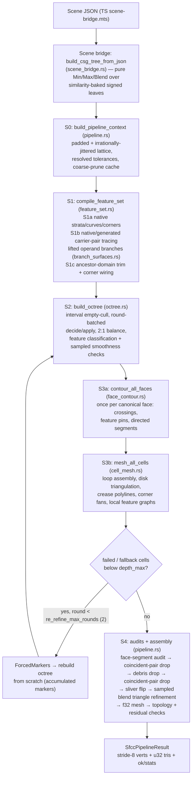

# SFCC Meshing Algorithm

**SFCC — Stratified Feature-Conforming Contouring** — is the Rust meshing kernel (`gcad-wasm/kernel/src/sfcc/`) that converts an implicit CSG scene (a signed-distance-field tree plus an axis-aligned world cube) into a feature-conforming triangle mesh with explicit validation diagnostics. It is the default exporter; the app also has other export paths.

This document describes the implementation reviewed on September 7, 2026, including `232fd6eb`, the composite-subtraction correction in `3a2f2ab3`, and the branch/interval preservation work described in the [implementation results](plans/sfcc-feature-preservation-results.md). It supersedes the [original design](research/sfcc-algorithm-design.md) and [partition proposal](research/sfcc-spatial-partition-meshing.md). Those documents describe goals, not delivered guarantees. Known implementation limitations are collected in §11; the [analytical-feature audit results](plans/sfcc-analytical-feature-completeness-results.md) provide reproductions and test evidence.

Audience: developers familiar with isosurface extraction (marching cubes, dual contouring) but new to this codebase.

---

## 1. Overview

SFCC is a **primal, face-sharing contouring method in the CMS (cubical marching squares) family**, with three distinguishing ideas:

1. **Symbolic features, not sampled ones.** Candidate sharp edges and corners come from model structure and field branches, rather than a normal-clustering or QEF detector. Numerical samples still determine their discovery, exposure, and trimming. Before any spatial refinement, the CSG tree is compiled into an analytic **feature set**: smooth surface patches ("strata") represented by unbounded analytic *carrier* surfaces, 1D crease **curves** defined as loci `{f_A = f_B = 0}` on carrier pairs, and 0D **corners** where curves meet. Boolean intersection seams are numerically traced on carrier pairs and then trimmed against the CSG tree. Feature vertices are evaluated on these objects using closed forms or numerical projection. Failed projection is reported; best-effort meshes may contain fallbacks. There is **no QEF**, but projection can place vertices within a small margin outside the nominal cell.

2. **Stratified octree refinement with bounded budgets.** An adaptive octree attempts to make each leaf *simple*: at most one routable feature curve through it (or exactly one claimed corner), and per-stratum smoothness checks (sampled normal-variation cones and edge derivatives) pass. At the depth ceiling, unresolved leaves remain explicitly tagged degenerate. Smoothness is checked **per stratum** against each patch's own analytic carrier — this is what lets refinement terminate at a crease instead of chasing the globally-kinked field forever. Blend bands are checked against the tree's own gradient cone; supported chamfer patches additionally provide carriers for feature tracing and meshing.

3. **Deterministic shared identity.** Shared crossings are interned under integer/string *provenance keys* (cell-local interior points are unkeyed); edge roots are computed after canonicalizing endpoint order; leaves are sorted; the lattice origin is jittered by irrational offsets. These choices stabilize repeat runs and partition merging. Regression fixtures check repeatability and serial/partition agreement; they do not prove arbitrary traversal, platform, or partition independence. Worker exports may recover by rerunning serially (§7.2).

The final mesh ships with **explicit validation status**: topology, face consumption, final vertex residuals, and unresolved numerical/refinement work. Bounded re-refinement and heuristic cleanup precede final validation. A returned mesh may be incomplete or fail its audits.

The [analytical-feature audit](plans/sfcc-analytical-feature-completeness-results.md)
records tested derivative and displaced-branch corrections, along with open
periodic-operator and feature-chain coverage gaps. Full, pruned and paired WASM
normal queries now compose raw derivatives before normalizing. Preview shader
normals still have a separate composition discrepancy and are not a reliable
independent derivative reference for nested blends.

### Pipeline diagram



The driver is `run_sfcc_pipeline_impl` (`gcad-wasm/kernel/src/sfcc/pipeline.rs`). Note that S2/S3a/S3b sit **inside** the re-refinement loop; the audits and S4 tail run once afterwards. There is no post-mesh decimation stage.

---

## 2. Scene ingestion: the bridge and the SDF query layer

### 2.1 The bridge (`scene_bridge.rs`, `src/export/sfcc-rs/scene-bridge.mts`)

The TS side serializes the live scene graph into a self-contained recursive JSON tree (`BridgeNode`) with a deliberately restricted vocabulary: **7 primitives** (box, sphere, cylinder, cone, plus profile shapes extrude / loft / lathe carrying raw 2D polygon vertex lists), **3 transforms** (translate; rotate as a row-major world-to-local matrix; uniform scale), and **3 booleans** (n-ary union, binary subtract / intersect), each boolean optionally carrying smooth-blend parameters (radius `r`, mode name, periodic count `n`). Serialization is not an acceptance guarantee: the Rust bridge also validates parameter restrictions, including positive uniform scales and unsupported cylinder fillet/chamfer parameters. Rejections carry node information. Node ids ride along for error messages only.

`build_csg_tree` folds this into a pure algebraic CSG — `Min` / `Max` / `Blend` combiners over transformed leaves — with two normalizations during the walk:

- **Single subtree complement.** Each operand is built in its ordinary orientation. Subtraction constructs `Max(A, negate(B))` (or its supported Smax blend), complementing the completed RHS exactly once. `sdf::negate` flips leaf/stratum signs and applies De Morgan transformations. The bridge rejects a cutter containing a columns operator with a node-specific error because the existing columns formulas do not provide a supported subtree complement. Independent compound-cutter tests cover union, intersection, nested subtraction, variadic lowering and transformed cavity normals.
- **Transform baking.** Translate/rotate/uniform-scale compose into a single `Similarity` (rotation R, translation t, uniform scale s) baked into each leaf; the kernel tree contains **no transform nodes**. A leaf's field is `f = sign · s · shape(R⁻¹(p−t)/s − pos)`. Non-uniform or non-positive scale is rejected (NaN-safely via `!(sx > 0.0)`).

Audit the **serialized scene**, not just the fluent source spelling. Application operations can propagate blend settings into child unions: the bracket’s source-level inner `.round(2.5)` becomes chamfer radius 1.2 under its enclosing chamfer. The scene fixtures exercise the actual application serializer so kernel tests describe the geometry being exported.

After the walk, leaves get dense left-to-right preorder indices, and each leaf's **strata** (its analytic carrier patches) are recomputed in Rust in the same traversal order with a running global first-id. Strata are deliberately **not serialized** across the wasm boundary — only the scene is — so feature compilation uses the kernel’s current carrier definitions, rather than a second serialized feature graph.

### 2.2 Field values, derivatives, and normals (`sdf.rs`, `field_branches.rs`)

There is no precomputed Hermite table. The Rust/WASM SFCC kernel evaluates its serialized CSG representation on demand in f64. This is distinct from the GPU preview and the GPU-sampled iso-simplicial exporter; the recent diagnostic API reuses the existing kernel evaluator.

- **`f(p)`** folds hard Min/Max or evaluates a blend. Binary blends preserve source operand order. With more than two children, the two smallest sign-adjusted values select the blend operands; this is not an associative left fold. See [smooth union ordering](smooth_union_ordering.md).
- **Raw differential** (`FieldSample`) carries a scalar value and its unnormalized derivative. Hard nodes route the winning branch; blends apply their formula’s chain rule. Twist, height interpolation, similarity transforms and negation participate in that composition. One-sided routing handles nondifferentiable ties; it is not a claim that a derivative exists there.
- **`grad(p)`** returns the scalar value and a unit direction, normalized only after composing the full raw differential. Full, pruned and paired queries share this contract. A zero/nonfinite final derivative yields a zero direction; primitive singularities still have shape-specific behavior.
- **Intervals** use primitive coordinate bounds where available (sphere, box, cylinder), otherwise Lipschitz ball enclosures. Twisted extrusion and morphing loft require local bounds rather than assuming an exact distance field. Hard and blend nodes compose bounds. Empty-culling is sound only where the underlying bounds and operator continuity assumptions hold; the known columns discontinuity in §11 prevents a universal claim.
- **`active_owners_at(p, tol)`** reports primitive leaves that remain competitive through their ancestry. Multiple owners are candidates for a seam, not a proof of its dimension or exposure. A displaced blend surface can have no primitive owner and still contain generated surface patches or creases.
- **Advisories and pruning** provide gradient bounds, blend presence, optional curvature estimates and region-pruned tree views. Pruning is intended to preserve queries inside its validity region and retains binary versus n-ary blend semantics. Regression tests compare full, pruned and paired results; this does not certify all inputs.

For a soft union, `wa = clamp(0.5 + 0.5*(b-a)/r, 0, 1)` and
`∇f = wa*∇a + (1-wa)*∇b`. Normalizing the child derivatives first discards their magnitudes and changes the direction of a nested blend. Differentiating `min` and `abs` independently at equality can also choose inconsistent sides. The current shared differential avoids both errors.

Production projection uses analytical derivatives. Tests use converging scalar finite differences as an independent control. GPU `sceneSDF` normals still compose unit directions differently; `SDFResult.g` is a stepping estimate, not the missing raw derivative magnitude. Consequently GPU normal agreement is not yet a correctness oracle for nested SFCC blends.

---

## 3. Stage 0 — pipeline context: lattice, jitter, tolerances

`build_pipeline_context` (`pipeline.rs`) runs once per export:

- **Padding + irrational jitter.** The world cube is padded by `bounds_padding_mm` (default 2 mm). The lattice origin is then offset per axis by *distinct irrational fractions of one max-depth cell step*: with `step = total_size / 2^depth_max`, the offsets are `(√2−1)·0.25·step`, `(√3−1)·0.25·step`, `(√5−2)·0.25·step` (`pipeline.rs`). Deterministic (no RNG), this is the lattice-degeneracy guard: it reduces common grid alignments but floating-point rounding and user-selected coordinates can still produce coincidences.
- **Feature compilation** (§4 below) is invoked from here (`compile_feature_set`, `pipeline.rs`).
- **Resolved tolerances** (`tolerances.rs`): the mm/degree/factor knobs are resolved once into absolute world-space values (§8.1).
- **Precomputation**: global `grad_bound`, `has_blend`, certificate thresholds stored as cosines, and a coarse-prune gate (enabled only when the tree has > 12 leaves).

The result is `SfccLattice` (a dyadic integer lattice, `2^max_depth` per axis; every cell and corner sample is addressed by integer lattice coordinates, so exact key equality replaces float comparison) plus the immutable `PipelineContext` shared by the serial driver and the worker `prepare` path.

---

## 4. Stage S1 — feature compilation

`compile_feature_set` (`feature_set.rs`) produces the `SfccFeatureSet { curves, corners, index, strata }` — the working feature graph later stages consult, read-only. It can omit geometry when branch representation or numerical discovery is incomplete.

### 4.1 Strata and supporting fields (`kernel/src/strata.rs`)

A stratum describes a candidate surface patch by a supporting carrier. Its extension is not necessarily an exposed face of the final solid. Native carriers include planes, spheres, cylinders, cones, cylinder-rim distance fields, twisted sides and loft sides. Generated `Field` carriers reference actual operand fields and selected branches; `Compound` carriers combine supporting expressions.

`raw_field` returns the value and derivative needed for composition and Newton solves. Some ruled carriers expose a distance-like normalized residual through `f`; that residual must not be composed as though it were the original field. Numerical `project` is a bounded root projection, not a general exact closest-point operation. Curvature bounds are available only for supported cases.

A stratum’s sign encodes orientation. It does **not** make every point with negative carrier value part of the final solid. Domain predicates and ancestor-path checks determine where a carrier is applicable and exposed. Coincident carriers may carry alternative domains.

Primitive stratum IDs follow leaf traversal order. Native feature construction and the seam-tree leaf builder must maintain consistent numbering. Generated surfaces append their own IDs. The worker fingerprint checks the resulting geometry, strata and corner-to-curve-end incidence before prepared IDs are consumed.

### 4.2 Native features

Alongside strata, modeled sharp features are emitted analytically:

- **Box**: 12 edge segments + 8 valence-3 corners. **Cylinder**: 2 rim circles. **Cone**: base rim circle + apex corner (incident only to the mantle). **Sphere**: nothing.
- **Lathe**: one rim circle per profile vertex where adjacent carriers genuinely kink (exactly-collinear turns skipped); axis poles become cone-apex corners.
- **Extrude**: cap-rim segments, profile-vertex corners, vertical edges — exact segments untwisted, sagitta-adaptive sampled helix polylines when twisted.
- **Loft (uniform topology)**: each vertical morph curve is the closed-form crossing of two height-interpolated edge lines, sampled at 65 heights, validity-gated (crossing must lie on the true blended-profile zero set to 1e-6 relative), and collapsed to an exact segment when chord deviation < 1e-9 relative — else kept as a traced curve.
- **Loft (differing vertex counts)**: an **angular cyclic merge** of both profiles' corners about their centroids yields a monotone `(a_edge, b_edge)` staircase of side carriers (`loft_seg_carriers`, `feature_set.rs`). A corner-matching rule merges a cross-profile adjacent event pair into one diagonal step iff its angular gap is a *sharp local minimum* (`gap < 0.5·min(neighboring gaps)`) — preventing a physically-single corner from spawning a sliver carrier and duplicate creases. Morph creases are then emitted only over maximal sub-runs passing **two gates**: (1) the sample lies on the blended-profile zero set after Newton projection onto `(1−t)·sdf_A + t·sdf_B = 0`; (2) its nearest A and B polygon edges are the carrier boundary's own edges. Candidates failing these sampled gates are dropped; the gates do not establish exhaustive coverage.

### 4.3 Curve representation (`feature_curves.rs`)

Three curve kinds share one interface (`point_at` / `tangent_at` / `project` / `axis_plane_crossings` / `param_distance`):

- **Segment** (t ∈ [0,1], exact line), **Circle/arc** (θ in radians, wrap 2π when closed) — exact closed forms.
- **Traced** — a sampled approximation to the two-carrier locus `{f_A = f_B = 0}`. `point_at_checked` interpolates and requires finite carrier-pair projection within `curve_eps`; failure returns `None`. The best-effort `point_at` wrapper retains raw interpolation on failure and increments `curveProjectionFailures`. Unsolved triple-point endpoint refinements also increment that counter. Failed crossing queries are not cached, so later refinement cannot hide their diagnostics. Tangent = `normalize(∇A × ∇B)`, oriented along increasing parameter.

Every curve carries exactly **two adjacent stratum ids** (`adjacent_strata: [usize; 2]`), corner ids at its ends (−1 = free end), closed/wrap flags, a `native` flag, and a coarse polyline used for indexing and sampled bookkeeping.

The key downstream query is **`axis_plane_crossings`** — candidate intersections of the represented curve with an axis-aligned plane (an octree cell face): closed-form linear solve for segments, closed-form `R·cos(θ−φ) = C` for circles, per-chord sign-bracketing + Illinois regula-falsi *on the re-projected curve* for traced kinds. Each crossing reports position, parameter, and `|tangent · axis|` as a transversality measure. A memoized variant keyed `(curve_id, axis, coord.to_bits())` lives in a thread-local cache invalidated by the feature set's monotonic `run_id` — but note: **only the octree classification hot path uses the cached variant** (`refine_criteria.rs`); face-pin creation calls the uncached one.

### 4.4 Newton primitives (`newton.rs`)

- **`project_to_carrier_pair`** — minimum-norm Newton onto `{f_A = f_B = 0}`: `dp = −Jᵀ(JJᵀ)⁻¹ r`, with J rows the (unit) carrier normals, so `JJᵀ = [[1,c],[c,1]]`, `det = 1−c² = |n_A × n_B|²` — which doubles as the parallelism guard (bail below `min_cross²`). Each row is the raw field derivative divided by its magnitude, and its residual is divided by the same magnitude, including for ruled carriers. Each Newton step uses up to eight backtracking attempts, accepting only finite, decreasing residuals within the original displacement cap; exhausted recovery returns failure.
- **`project_to_triple`** — the 3×3 analog solved by Cramer, for corner/triple-point refinement; callers keep their seed on failure.
- **`carrier_pair_tangent`** — `normalize(∇A × ∇B)` plus its pre-normalization magnitude (= sine of the dihedral for unit-gradient carriers), reused as the tracer's tangency measure.

Production Newton solves use analytical derivatives; regression diagnostics also use finite differences as an independent reference.

### 4.5 S1b — boolean seam tracing (`seam_trace.rs`)

Seams created by CSG (rather than modeling) are traced **on carrier pairs** (native supporting surfaces or generated operand-field expressions), and are deliberately **over-traced** onto carrier extensions beyond the real faces — domain checks and CSG trimming (S1c) select candidate exposed portions, subject to numerical sampling limits.

For every unordered pair of CSG leaves whose margin-inflated world AABBs overlap:

- **Blend-displacement skip.** If the pair's lowest-common blend combiner displaces the seam off the carriers by more than `surface_tol` — displacement = `|smin(mode, 0, 0, r, n)|` at the LCA, precomputed bottom-up into a leaf×leaf matrix (`tree.rs`; hard Min/Max leave 0) — the pair is skipped entirely: a soft fillet replaces the sharp seam with smooth surface, so tracing would be wasted (trim would kill every sample).
- **Seeding.** A deterministic grid over the overlap box (cell ≈ overlap-diagonal/8 unless overridden): grid points with both `|f_A|, |f_B| ≤ cell` are Newton-projected onto the pair locus, bounds-checked, and deduped only within eight times the numerical curve epsilon. Scene-scale distance alone does not establish component identity.
- **Predictor–corrector marching.** Step along the carrier-pair tangent, correct via the pair projection. Guards: tangency bail below `min_tangency_sin`; tangent-flip stop (passed a singular point); halve the step on projection failure, on corrector displacement > h/2 (branch-jump guard), or on turn angle > 0.35 rad; chord-error adaptation `err ≈ h·θ/8` (halve above tolerance, ×1.4 below a quarter of it) within clamped [h_min, 4·h_init]; closed-loop detection (returning within min(0.9·h, 2·chord tolerance) of the seed after >3 samples); hard step cap (`max_trace_steps`, 20000/direction).
- **Assembly.** Closed traces emit seed + forward samples + seed (exact closure); open traces emit reverse(backward) + seed + forward. Seed consumption first checks distance to finite polyline segments, then verifies local carrier-normal agreement and projects the existing locus onto the normal plane through the seed. It requires agreement at numerical precision and does not consume beyond endpoints. A re-trace is discarded only when all its samples, including endpoints, are already covered; midpoint overlap alone is insufficient.

At an exposed field-branch transition, a finite tangent jump can survive step reduction. Once the crossing step is at most one tenth of the chord tolerance, the tracer permits bounded correction, requires forward progress and valid adjacent domains, and bisects the tangent transition. It emits separate arcs sharing that junction. Hidden supporting extensions do not receive this continuation treatment. Trimming preserves the adaptive source knots when remaking an arc.

Each surviving piece becomes a `Traced` FeatureCurve carrying its polyline plus both carrier strata and refinement tolerances.

**Generated blend surfaces.** `blend_surfaces.rs` references the actual operand subtrees in a shared immutable scene tree. It no longer reconstructs their off-surface values from primitive supporting planes, caps, or mantles. This preserves box edge/corner distances, capped-cylinder and cone rim distances, polygon vertex regions, lathe endpoints, and the clamped loft/twist fields consumed by a blend. For signed child fields `a` and `b`, a chamfer adds `(a + b − r)/√2` for a union or `(a + b + r)/√2` for an intersection. Other blend modes contribute their actual operator field so later hard cuts can intersect its surface. `branch_surfaces.rs` additionally lifts extrusion cap/side and twist-clamp branches, loft cap/side and height-region branches, nested hard/chamfer branches, and multi-operand blend pair choices through their enclosing blend. Adjacent branch fields are traced as explicit pairs, outside the ordinary carrier cross product. Enclosing chamfers use their supporting affine expression so their two branches remain independent at an attachment endpoint; pointwise domain checks require agreement at every intervening combiner. The numerical band distinguishing native from displaced ownership is fixed at compilation, independent of the caller’s positional tolerance. This is not exhaustive enumeration of arbitrary polygon medial-axis or periodic stairs/columns boundaries.

Field composition retains scalar values and unnormalized analytical derivatives. Newton projection scales each equation's residual and Jacobian row together; it does not differentiate a normalized residual as though its derivative were a unit normal. Pair and triple solves reject singular/non-finite equations; pair projection backtracks unsuccessful steps. Pair and triple constraints must have independent gradients even when their initial residuals are already zero: coincident surfaces along a rim do not define a unique corner. Cell-interior and face-midpoint Newton projection also use raw full/pruned field derivatives; trim flank agreement uses the normalized raw tree derivative. The public kernel normal API still returns unit directions, now derived from the composed raw derivative; GPU preview normals have the separate limitation in §2.2.

For a loft with differing profile vertex counts, each cap edge contributes candidates for every adjoining side carrier. The closest edge of the opposite profile can change along that rim; choosing only the first side carrier would leave portions unconstrained after trimming. Domain and flank tests select the surviving intervals. Housing regressions require the exposed square rim, including its upper corners, to follow exported mesh edges within `1e-5` mm.

Each generated surface records its owning subtree. Trimming requires the surface to survive at every ancestor on that path, as well as on the final CSG surface. A later cutter's zero value therefore cannot make an already-hidden surface appear active again. Coincident planar carriers merge their alternative domains. The remaining domain checks are pointwise, not certified interval exclusions.

For example, the housing in `docs/manim/scenes/torture_housing.yaml` has coplanar barrel/flange caps at z = 19. Its radius-1.5 chamfer union moves the exposed plane to z = 19.75. Tracing the bore only against the original caps misses its circular rim. The WASM regression `gcad-wasm/fixtures/sfcc-housing_test.mts` verifies full rim coverage and sampled triangle error below 0.02 mm, as well as edge, vertex-link, and shared-face audits. It also checks explicit transition edges and the absence of triangles bridging the X-shaped cylinder/chamfer boundaries, including their shallow arms near the tangent crossing. Screw-hole triangle interiors are also sampled against the rim-distance chamfer and cutter fields, with a 0.02 mm error limit. Applying the ordinary 15° boolean gate to these modeled boundaries would truncate the arms before they reach the center; they instead retain the native-feature 2° near-tangency floor.

Complexity note: the primitive pair loop is O(leaves²) with per-pair O(|strata_A|·|strata_B|) traces, pruned by AABB overlap and the blend skip. Generated surfaces add pair traces. Operand fields share one scene tree, avoiding eager Cartesian expansion of all primitive distance regions; candidate tracing can still grow with the number of surfaces.

### 4.5.1 Why displaced branch boundaries need their own curves

A primitive’s surface features describe its **zero set**. A blend evaluates that primitive away from zero, where its field can have other derivative branches. Trimming the original edge cannot move it to a new displaced crease.

For example, inside a square extrusion with half-width 2, the profile field is
`max(abs(x), abs(z)) - 2`. Its inward level `f = -0.4` has a corner at
`x = z = 1.6`, not at the original corner `x = z = 2`. The inset regression uses an enclosing chamfer to expose this displaced branch intersection. Conversely, outward segment endpoint regions can join smoothly and must not receive artificial crease curves.

`branch_surfaces.rs` enumerates explicit alternatives and lifts them through the enclosing expressions:

| Branch family | Alternatives represented |
| --- | --- |
| Hard and blend nodes | Child fields, chamfer supporting expressions, selected blend operand pairs. |
| Box | Face fields, including interior face-selection transitions. |
| Cylinder / cone | Radial or mantle field and cap/base fields. |
| Lathe | Finite profile-edge fields, including clamped endpoint regions. |
| Extrusion | Side versus caps, individual finite polygon segments, bottom/interior/top twist regions. |
| Loft | Side versus caps, height interpolation/clamp regions, and a fixed pair of profile edges in each interpolation interval, including simultaneous edge changes. |

Ancestor blend partners are explicitly selected and guarded by signed nearest-two conditions. Binary operand order is retained. Branch descriptors include source paths, branch alternatives, selected ancestor partners and the native exclusion band; semantic fingerprints include those descriptors, domains, source expressions and junction incidence. Partner lists are shared and repeated branch descriptors are interned within each source-node expansion. Expansion currently has a 128-state limit per ancestor path and a 128-edge-pair limit per loft interval; exhausted source paths are reported as `unresolvedBranchPaths`. This is bounded enumeration, not a general spatially adaptive region DAG.

Adjacent lifted expressions are traced as **explicit pairs**, in addition to ordinary carrier intersections. They reference actual subtrees and retain raw derivatives. Pointwise validity checks reject inactive regions; ancestor-domain tests prevent a later cutter from reviving a surface hidden by an earlier union. Domains are checked throughout ancestry, not only by asking whether the root SDF is zero.

This is the common mechanism behind the repaired housing bore/flange seams, shallow X arms, screw-hole attachments and bracket displaced edges. Correct primitive distances, independent constraint gradients, junction graph meshing and protected-edge refinement are also necessary; not every similar-looking artifact has a single cause. The branch table describes implemented families, not an exhaustive classification of all piecewise regions (see §11).

### 4.6 S1c — CSG trim and corner wiring (`trim.rs`)

Tracing retries retain the tangent at the current point, reject excessive chord error before accepting a step, and reduce the closing step near a loop's seed. Termination counters distinguish tangency, reversal, correction failure and budget exhaustion. Fixed seeding still cannot prove that every component was discovered.

Trimming uses progressively smaller flank probes near narrow strips. Probe spacing is not a minimum feature length: short arcs connecting nearby junctions survive down to the corner-merging tolerance. Endpoint refinement searches primitive and generated third surfaces even when the cutter already makes the root field zero. It accepts a triple only when all participating ancestor domains survive. A closed loop may legitimately start and end at the same corner; collapsed local stubs are discarded separately.

Near a trimming boundary, aliveness must also hold at the eventual f32 coordinates. Bisection retains the known-alive endpoint, preventing output rounding from crossing the surface-tolerance limit. Triple-point refinement considers generated surfaces as possible terminating surfaces alongside primitive strata.

Trim turns over-traced carrier mathematics into features of the **actual solid**. A curve point is **alive** iff:

1. **On the final surface**: `|f_tree| ≤ surface_tol`.
2. **Genuinely creased**: the two adjacent carriers' sign-adjusted normals disagree past a gate — native modeled curves and generated chamfer-patch boundaries use the permissive `native_crease_cos` (= cos 2°, dying only near tangency, e.g. when absorbed by a blend), other boolean seams need `min_dihedral_cos` (= cos 15°).
3. **Both flanks survive**: probing `±probe_delta` off the curve along `w = n × tangent` within each stratum (projected back onto its carrier), the *full tree* SDF must still nearly vanish (`|f| ≤ probe_delta·0.2`) with the tree gradient agreeing with that stratum's normal (dot ≥ 0.9) — for at least one probe sign per flank. This kills seam pieces where one of the two faces has been cut away.

Curves are sampled at ≈`probe_delta` spacing (count clamped to [8, 2048]; actual endpoints included). Alive/dead transitions are **bisected** on the parameter; interior transitions are **Newton-refined to triple points** `{f_A = f_B = f_C = 0}` by testing nearby primitive and generated third surfaces with `project_to_triple` and validating all ancestor domains. Numerical trace endpoints are also refined within a small fraction of the chord budget. If a composite carrier selects a derivative that makes its triple singular at the junction, the refiner tries an independent basis of explicit incident branches and validates the original curve equations at the result. Run endpoints plus surviving native corner positions merge greedily into corner candidates within `corner_merge_tol` (first-seen position wins). Runs are split at interior on-curve candidates (a box edge crossed by a seam becomes two curves meeting at the new corner); each final sub-range is re-emitted as a standalone curve (segments from endpoints; arcs re-fit through three source samples via circumcenter, sweep fixed by the midpoint; traced sub-ranges resampled at source density with carriers preserved). Endpoints snap to candidates within `max(2·corner_merge_tol, 2.5·probe_delta)`; degenerate stubs drop; corners are wired with `(curve_id, end)` incidence plus the union of incident curves' strata. After splitting, duplicate arcs are removed only when their carrier pair, endpoint pair, and mutually projected interiors agree; shared endpoints alone do not identify a loop arc. Corner incidence is rebuilt after deduplication. Only wired corners survive (plus valence-0 on-surface records like a cone apex); native corners' original wiring is *not* carried through — final corner records are rebuilt from scratch.

Note trim is a **tolerance-threshold sampled procedure**, not a certified classification: sub-sample aliveness flips can in principle be missed (see §11.2, D4).

### 4.7 Spatial index (`spatial_index.rs`)

A uniform hash grid indexes the compiled curve polylines and corners for nearby-feature queries. Curve IDs returned by `curves_in_box` are sorted. Consumers still check analytical geometry, domains and tolerances after this broad-phase lookup; the polyline index does not certify that no unrepresented curve exists.

---

## 5. Stage S2 — adaptive feature-aware octree

`build_octree` (`octree.rs`) builds an adaptive octree over the jittered lattice, with **inside ⇔ f < 0**, in two phases.

### 5.1 Descent with certified empty-culling

A recursive descent from the root to `depth_min` (default 5) discards any subtree whose interval enclosure of f over the **cell box** excludes 0 (`certified_empty` and `interval_over_box`; primitive coordinate ranges or a Lipschitz enclosure over the circumscribed ball): a zero-excluding enclosure permits omission of the cell, provided the field-bound assumptions hold (§2.2 and §11). The same cull runs on each of the 8 children at every split.

### 5.2 Round-batched refinement with 2:1 balance

The worklist loop is **round-batched**:

1. **Snapshot** the live frontier (filtering cells removed by a same-round ripple).
2. **Decide**: compute a pure `CellDecision` (split flag + feature tags) for every frontier cell in one pass over an immutable `SampleView` of the shared corner-sample cache. This pass is side-effect-free with respect to the octree (the only mutation is the lazily-filled coarse-prune view cache), which is what makes it partitionable across workers.
3. **Apply** serially, in frontier order (`apply_decision`, `octree.rs`): stamp `feature_curve`/`feature_corner` tags on the live cell; split cells that must split (each new child empty-culled at creation); ripple **2:1 balance** — splitting a level-L cell recursively force-splits any level-(L−1) leaf adjacent across the 6 faces (always) and the 12 edges (`enforce_edge_balance`, default true), a genuine mutual recursion split↔ripple. At fixpoint no leaf neighbors a cell more than one level coarser, bounding every face's halo to a 2×2 sub-face pattern (asserted by a test at `octree.rs`).

**Corner samples** live in one map keyed by packed finest-level lattice point; each cached lattice sample is stored once (`Sampler::sample_at` stores exactly `tree.f(...)`) and shared, so neighboring cells can never disagree on a corner sign. `SampleView` falls back to a *direct tree eval* on a cache miss — since every cached value is a raw `tree.f` value, an un-cached recomputation is bit-identical, the keystone of worker-side decision parity (§7.2).

A cell whose decision demands a split at `depth_max` (default 8) is instead kept and tagged **degenerate** — meshed best-effort by the normal cell path, counted in stats (`octree.rs`). `depth_max ≤ lattice max_depth` is asserted; `SFCC_MAX_DEPTH = 14` caps the lattice so `span³` stays exact in i64/f64.

Decision purity permits parallel evaluation of a fixed frontier. Apply order and balance propagation remain explicit; purity alone does not establish worklist-order independence. Leaves are sorted by `(level, key)` at finalize because leaf order seeds downstream point-table ids.

### 5.3 The per-cell decision (`PipelineContext::decide_cell`, `pipeline.rs`)

This is deliberately the **single code path** shared by the serial driver and the worker `prepare`, so they cannot drift. Its order:

1. **Feature classification** — `classify_cell_features` (`refine_criteria.rs`), on the cell box inflated by `feature_query_inflate` (0.25 cell):
   - *(i) at most one through-curve*: exactly two crossings of the six face planes, each **transversal** (`|tangent · faceNormal| ≥ tangential_epsilon` = 0.05, else split — a tangential crossing cannot be robustly localized to one face), each face crossed at most once *(ii)*. Zero boundary crossings with curve geometry inside (contained loop or endpoint) ⇒ split; a second through-curve ⇒ split.
   - *Corner cells*: more than one corner inside ⇒ split; exactly one passes only if every touching curve is incident to that corner and enters exactly once.
   - *Pin-visibility certificate* (through-curve cells): on each crossed face, every adjacent stratum's carrier must change sign over the face's four corners — otherwise the surface arc through the pin enters and exits through one boundary sub-edge (an even, invisible crossing) and face contouring cannot route it ⇒ split.
   - A passing cell is stamped with its curve or corner id — the tags cell meshing consumes.
2. **No external corner claim at the ceiling**: an unresolved cell retains the classifier's actual in-cell corner, if any. It cannot borrow a nearby corner outside its AABB to build a fan. Such external fans can overlap and create four-way edges when neighboring cells choose the same apex. The cell remains unresolved and takes the available edge/smooth fallback path.
3. **Forced-split markers** from prior re-refinement rounds (§6.3): any marker at level ≥ the cell's level whose point lies inside the cell box forces a split.
4. **Corner cells return here** — exempt from all smooth certificates and the sign gate: the corner is itself the carrier singularity.
5. **Curve-visibility sign gate**: a curve-tagged cell whose 8 corner samples show **no sign change** splits unconditionally — the feature would be invisible to face contouring.
6. **Smooth checks and surface discovery** — `needs_split_smooth`. Without a corner sign change, a conservative box interval must exclude zero to stop refinement. An inconclusive interval forces subdivision; at `depth_max` it becomes an unresolved degenerate leaf. For valid enclosures, this avoids declaring a same-sign cell empty solely from its corner samples; unresolved cells remain explicit at the ceiling.

### 5.4 Smoothness checks (`refine_criteria.rs`)

Default smoothness checks use a 9-point probe (8 cached corners + a directly-evaluated center), **stratified**:

- **Active strata** are found by taking probes within `reach = √3 · cellSize · grad_bound` of the surface, asking the CSG for active owner leaves at tol 0 (often empty on displaced blend surfaces), and picking each owner's closest patch. Multiple strata can be active per cell; each is checked separately.
- **(iii-b) Normal-variation cone** (the Plantinga–Vegter-style surrogate): each active stratum's carrier normals at the 9 probes must pairwise agree to `cos(normal_variation_deg)` (default 18°).
- **(iii-c) Edge-crossing uniqueness**: on each cell edge where the stratum's field changes sign, its directional derivative along the edge must not change sign between endpoints — a sampled monotonicity check, not a proof of a single crossing between endpoints.
- **(iii-d) Blend-band cone**: in a blend-carrying tree, cells with **no** active stratum use a blend-band check; normalized `∇f` of the *tree itself* at near-surface probes must fit a `cos(blend_curvature_deg)` cone (default 18°).
- Two global-field additions on stratum-*active* cells (i.e., the certification is per-stratum-first, not per-stratum-only): **mixed cells** in blend-carrying trees also run the tree-∇f band cone restricted to zero-owner probes, and any cell with a **LoftSide** carrier additionally runs the full tree-∇f cone — each ruled carrier is individually smooth while the true blended surface kinks *between* adjacent carriers where a crease is born or dies.

An opt-in **analytic variant** ("lever 2", default off) replaces sampled cones with closed-form curvature bounds: split iff `κ · cellEdge > θ` (the extent is deliberately the cell *edge*, not the diagonal, matching realized adjacent-vertex normal variation), with κ from supported per-tree blend bounds or per-stratum carrier bounds, capped position-aware by the local carrier-dihedral swing. These checks are not a general interval proof: the default cones and derivatives are sampled, and the analytic option uses a cell-edge extent and local caps. Passing does not certify continuous embedding or full surface coverage.

### 5.5 The coarse-prune cache

SDF evaluations during the decision (and later during face contouring and cell meshing) go through per-level-5-ancestor **pruned tree views** (`prune_to_box`, box padded 10%, lazily cached in `PipelineContext`), bit-exact within the padded coarse box, amortizing the O(tree²) prune-build cost. Gated to trees with > 12 leaves. Full/pruned parity is tested inside the view’s validity region; callers must keep their queries within it.

---

## 6. Stage S3 — contouring and meshing

### 6.1 S3a — face contouring (`face_contour.rs`)

**The CMS invariant: each canonical octree face is contoured exactly once**, into a shared `FaceRecord`, and consumed by both incident cells — the +axis-side cell as stored, the −axis-side cell reversed. Shared records give both cells the same boundary segments; successful consumption and topology are checked later. The canonical face set consists of the **minimal** faces: a coarse cell skips any face toward a split neighbor (the four finer quarter-faces are enumerated instead), and a coarse face's boundary edges are decomposed into minimal sub-edges wherever finer neighbors deposited lattice samples (`collect_edge_interior_offsets`, a recursive midpoint-sample-presence bisection in `math/grid.rs`) — so both sides find crossings at identical canonical sub-edges. Minimal-face subdivision handles adaptive-grid T-junctions. Local segment repairs, fallback paths and later cleanup also exist; sharing alone does not guarantee a valid mesh.

**Smooth path.** For a face with normal `axis` and in-face axes (u, v) chosen so u×v = +axis, the four boundary edges are walked CCW as seen from +axis. Per minimal sub-edge, a sign change of the cached corner samples yields an iso-crossing:

- **Root-finding** is Illinois modified regula-falsi (false position with retained-endpoint f-halving), run after **canonicalizing endpoint order** lexicographically-least-first — so the result is bit-identical regardless of traversal direction.
- The crossing is interned in the global `PointTable` under the exact integer provenance key `latticeKey·8 + axis` of the sub-edge's min corner, first-writer-wins — the same crossing discovered from any face, cell, or partition is the same vertex id. For lattice crossings, positions are payload. Feature pins and repair points use separate string-key conventions, including fixed-format parameters and coordinate bit patterns. Stored normal = the tree's one-sided unit gradient.

The cyclic walk yields lattice samples (with inside flags) interleaved with crossings; a state machine toggles inside-ness and tags each crossing **enter** (into f<0) or **exit**. Exits pair with enters into **directed segments** `exit → enter`, oriented so f<0 lies on the segment's LEFT viewed from +axis.

**Ambiguity resolution** (the classic MS ambiguous face): with < 2 inside runs, an exit pairs with the nearest unmatched enter *before* it in walk order (closing its own run). With ≥ 2 runs, the face center is sampled once — center inside ⇒ each exit connects *across* the face to the *next* unmatched enter (runs join through the center); center outside ⇒ runs stay separate lobes.

Two guards protect the downstream loop walk (which requires exactly one outgoing segment per point per cell): a **collinear guard** splits any segment whose endpoints lie on the same boundary side by inserting a face-owned, Newton-projected midpoint; and a global post-pass (`repair_face_duplicates`) splits every undirected segment emitted by two different faces, each side getting its own keyed midpoint.

Per-segment consumption counters (`consumed_fwd`/`consumed_rev`) are zero-initialized here and incremented by cell meshing — the raw material of the S4 closedness audit.

**Feature paths** (active when a feature set is supplied):

1. **Pins.** For each curve near the face (sorted spatial-index query), its `axis_plane_crossings` (closed-form or numerically projected) with the face plane are filtered to the face rectangle and interned under string keys `"F{axis}:{faceKey}:{curveId}:{t:.12}"`, with normal = normalized sum of the two adjacent strata normals. The **single-pin route** — exactly 1 pin and exactly 2 crossings — emits `exit → pin` and `pin → enter`: a single kinked arc through the evaluated feature point. Otherwise an unrouted pin is **spliced** into the segment that "crosses its curve's wedge" (endpoints stratum-tagged with the pin curve's two adjacent strata), else the nearest segment (a minimum-length floor of 8·root_tol is tried first, then dropped).
2. **Stratum tagging + per-stratum pairing.** Each visible crossing is attributed to the nearby stratum with smallest carrier |f| under 4·root_tol whose carrier normal aligns with the tree gradient (|cos| ≥ 0.9). A pairing pre-pass then runs: **only when a stratum has exactly one tagged enter and one tagged exit**, and the pair's midpoint lies near the surface (|f| ≤ 5% of the face extent), they pair with each other regardless of the run rule — handling wedge-side configurations the center-sample decider would mis-pair.
3. **Recovered crossings.** A sub-edge with *no* tree-f sign change can still dip through a feature wedge (e.g. near arc endpoints, both surface crossings between lattice samples). Per stratum adjacent to nearby curves, carrier roots along the edge are found by 8-fold subdivision + bisection (optionally Lipschitz pre-culled); a root is a candidate only if `|f_tree| ≤ 4·root_tol` there. Candidates are sorted and deduped; **when more than 2 remain**, they are verified against ground truth (tree-f inside-ness must actually flip across adjacent gap midpoints). Survivors must be **even in count** (parity defense) and pass a structural gate: with exactly 2 survivors, they must form a "wedge pair" (two strata adjacent to a common curve or sharing a common corner); with more, each *material dip* (consecutive pair whose between-gap insideness differs from the edge-end state) must — a single failure drops all. Survivors become keyed extra crossings on the boundary walk, stratum-tagged so the per-stratum pass pairs them; being paired, they preserve enter/exit parity.

**Structure.** One pure `contour_face` serves three drivers: serial; shared-map partitioned (first enumerator wins — grouping-independent); and separate-table per-worker, which additionally contours "halo" quarter sub-faces at T-junctions toward finer regions in other groups so N partial meshes merge back to the serial result by global provenance keys. All face SDF queries route through the coarse-prune views.

Nearby curve candidates are returned in sorted ID order so equal-residual carrier recovery and face tagging do not depend on hash iteration. Duplicate-segment repair also breaks equal segment-index ties by face coordinates before allocating midpoint IDs.

### 6.2 S3b — cell meshing (`cell_mesh.rs`)

Cells can contain multiple junctions, multiple curves, or a corner incident to a curved arc, including unresolved cells at the depth ceiling. Before the single-corner/single-curve paths, these cells attempt a local feature graph: boundary segments, face pins, true corners and sampled in-cell feature arcs form a half-edge graph. Its bounded faces select a common adjacent stratum and are triangulated separately. Every boundary edge must be used once and every internal feature edge twice before accepting the graph. The current graph path requires one boundary loop; unsupported arrangements retain the existing fallback/refinement diagnostics.

Each leaf gathers its six sides' segments: a same-level neighbor face is consumed as stored (+axis side) or reversed (−axis side); a face toward a finer neighbor (2:1 balance guarantees at most one level) is consumed as up to four quarter-faces at level+1. The directed segment soup is assembled into **closed loops** by requiring every point to have exactly one outgoing segment; any duplicate-outgoing point, dangling endpoint, or re-entered segment marks the **whole cell failed** — it emits nothing and is fed to re-refinement rather than emitting garbage.

**Smooth loop triangulation** (`triangulate_loop`):

- 3-loop: emit directly. 4-loop: split along the shorter diagonal (a pure-geometry choice — the SDF is not consulted).
- ≥5-loop (default `InteriorVertexMode::Project`): place an interior vertex at the loop centroid, Newton-project onto the surface with steepest-descent steps `p ← p − f·∇f/|∇f|²` (stop at `|f| ≤ surface_tol/4` or on leaving the cell box inflated by 0.1·cellSize). Accept only if **on-surface** (|f| ≤ surface_tol), **in-box**, and **on the same sheet** as the loop (summed loop-vertex normals · ∇f > 0). On rejection, fan from the boundary vertex maximizing worst ear quality `2·area/longestEdge²` (`best_fan_apex`).

Cell-local SDF queries may run against a per-cell `prune_to_box` view (half-width 0.6·cellSize, covering the 0.1·cellSize query margin, hence bit-exact for every query the meshers make).

**Feature graph first.** Cells with multiple corners, degenerate cells with multiple pinned curves, and cells with a corner incident to a curved arc first assemble all in-cell arcs into a graph, sample the analytical arcs, and mesh each resulting patch. This preserves curved arcs at ordinary single-corner junctions. Ordinary straight-corner cells retain the exact corner fan below; the stamped paths also remain fallbacks when the graph cannot be embedded.

**Edge cells** (stamped `feature_curve ≥ 0`): the cell must own exactly **two pins** of its stamped curve. The loop containing both pins is split at them into two chains; the analytic curve is sampled between the pin parameters into an in-cell polyline — for closed curves, the arc whose midpoint lies inside the cell is chosen among the two candidates. Interior sample counts: circles use the exact chord-error formula (max step from `r(1−cos(dθ/2)) ≤ curve_chord_tol`); traced curves preserve the original adaptive knots and check projected quarter points and midpoints, subdividing with an internal safety margin against the requested chord tolerance; segments get zero. Exceeding `max_polyline_points_per_cell` (16) reports a chord-budget failure and returns to feature fallback. In-cell samples require successful `point_at_checked` projection and the existing cell margin, normal = normalized sum of both strata normals. Each chain + the (appropriately reversed) polyline forms a closed disk; the two disks are assigned to the curve's two adjacent strata by an aggregate normal-agreement score over non-pin chain vertices — both assignments scored, the better taken, never rejected. Each disk is fanned from an interior vertex obtained by projecting the disk centroid onto that stratum's carrier, accepted only if in-box, on the final surface, and tree-gradient-aligned with the stratum normal (`|g·n|/|g| ≥ 0.8`); else a boundary fan.

**Corner cells** (stamped `feature_corner ≥ 0`): every loop touching a pin of a corner-incident curve is fanned directly from the **compiled corner point** (closed-form or numerically refined) — a single string-keyed shared vertex (`"corner:{id}"`, normal = normalized sum of incident strata normals) — at arbitrary valence. A valence-0 corner (e.g. a cone apex) fans all loops.

**Fallback.** Feature cells whose special path cannot run (pins don't route, loops don't line up) fall back to smooth meshing, subject to loop and topology checks, and are counted as `feature_cell_fallbacks` for exactly one forced re-refinement round.

### 6.3 The re-refinement loop (`pipeline.rs`)

After each contour + mesh pass:

- **Failed cells** (loop assembly broke) below `depth_max` become suspects **every round**; **fallback cells** are added **only on round 0**.
- Each suspect's cell center + level becomes a `ForcedMarker`. The **entire octree is rebuilt from scratch** with the accumulated marker list (markers are never cleared — necessary since each rebuild starts fresh): any leaf at level ≤ marker level containing the marker point must split, regardless of certificates.
- The loop runs at most `re_refine_max_rounds` (default 2) extra rounds, or until no suspects. Refinement is *localized*; recomputation is global (the whole octree/contour/mesh re-runs). Residual failures after the cap ship best-effort with `ok = false`.

---

Graph faces can share a geometric patch through different native and lifted stratum IDs. The graph mesher chooses among incident carriers by agreement with the face vertices, rather than requiring an identical carrier ID on every boundary edge. This prevents a valid junction graph from falling through to a single-corner fan that loses other curves. Failed graph attempts and incident arcs without a second endpoint remain explicit feature fallbacks even if that fan produces a disk.

## 7. Stage S4 — audits and assembly; parallel execution

### 7.1 S4 tail (serial driver, `pipeline.rs`)

Run once, after the loop:

1. **Face-segment audit**: every interior face segment must have been consumed exactly once forward and once reversed (`consumed_fwd == 1 && consumed_rev == 1`) — a shared-boundary consumption check: neighboring cells traverse each shared segment in opposite directions. Skipped if failed cells remain (adjacent faces then legitimately miss a consumption). Diagnostic: it sets `ok = false`, it does not trigger repair.
2. **Coincident-pair drop**: coincident opposite-winding triangle pairs (grouped by unordered vertex triple, paired even-vs-odd permutation) removed.
3. **Debris drop** (union-find over triangles): noncollapsed closed oriented manifold components are preserved regardless of size or proximity to a feature. Components with fewer than four distinct physical positions cannot enclose a solid and remain eligible for cleanup. For remaining components: micro components with AABB diagonal < 4·lattice-step, and "feature-hugging tubes" (≤ 600 verts, all within 2·step of a feature curve); never the dominant component; all iteration deterministically sorted.
4. **Coincident-pair drop again**, then **sliver flip** (`sliver_flip.rs`): a triangle with aspect `2·area/longestEdge²` (= height/longest-edge) below 0.02 flips its longest edge into the neighbor quad — `(p,q,r)+(q,p,d) → (r,p,d)+(d,q,r)`, a winding-preserving diagonal swap — only if the neighbor is untouched this sweep, no r–d edge exists in either direction (including edges created this sweep), and the pair's worst aspect improves by **more than 2×** (and above 1e-6). Compiled crease and corner-fan crease edges are protected from flipping. Up to 4 sweeps, edge map rebuilt each sweep; edge identities use tuples without packed-index aliasing. Cures cap slivers whose small dimension is vertex-to-edge (unreachable by any weld); this is a shape heuristic, not a triangle-interior surface-error guarantee.
5. **Sampled blend-surface refinement** (`surface_refine.rs`): after partition assembly, test triangle centroids and edge midpoints against the chord-tolerance value (using a 0.75 margin). Split shared edges conformingly and project new points with the raw derivative; protected-edge splits project onto the recorded curve **within its oriented parameter interval**. Closed-curve intervals remain unwrapped across their parameter seam. Traced parameters index unevenly spaced knots, so projection searches the interval’s knot spans instead of assuming its parameter midpoint is a geometric midpoint. Every membership receives its own split parameter; child intervals partition the parent. Missing or incompatible memberships keep the edge locked and leave refinement unresolved. This addresses small local blend radii even at the octree depth ceiling. Refinement has eight rounds and a bounded added-geometry budget; remaining sampled failures count as chord-budget failures. These are field-residual samples, not a certified Hausdorff or embedding bound.
6. **Compaction and feature-chain audit**: check that recorded edges remain triangle edges after cleanup; check sampled bidirectional curve/chord distances, parameter coverage and connectivity. Audit the f32 positions actually shipped. `PointTable::build_mesh` compacts points in first-reference order and emits stride-8 f32 verts plus u32 tris; `compacted_curve_edges` applies the same remapping to all surviving interval memberships. The WASM result and `mesh.debug.sfcc.featureEdges` expose f64 records `[vertexA, vertexB, curveId, start, end]`.
7. **`check_manifold`** (`manifold_check.rs`): purely combinatorial. Undirected edge key `min·2²⁷ + max` (exact to ~134M vertex ids) accumulates a use count + direction balance. Count 1 ⇒ open edge; ≥3 ⇒ non-manifold; 2 with nonzero balance ⇒ misoriented. Vertex-link check (default **on**, optionally disabled) catches bowtie vertices via a single-cycle successor-map test. Per-component Euler characteristic is computed and reported but is **not** part of the verdict. `manifold.ok` = all four defect counters zero.

**Validation** is returned in both serial and worker `stats_json.validation`, and exposed as `mesh.debug.sfcc.validation`. `status` is `passed`, `failed`, or `incomplete`. Individual `edgeIncidence`, `vertexLinks`, `faceSegments`, and `vertexResiduals` audits are `passed`, `failed`, or `notChecked`. Final vertex residuals are measured after f32 conversion against `surface_tol_mm`; they do not bound triangle interiors or Hausdorff error.

**`ok = true`** requires all four audits to pass, no unresolved/failed cells, no feature fallback cells, no recorded curve-projection, face-projection, or chord-budget failures, no unresolved branch expansions, and no failures in a performed compiled-feature-chain audit. A failed audit takes precedence over incomplete checks. Disabling vertex links yields `notChecked` and prevents success. An empty mesh can pass if its domain was excluded by the interval bounds; an empty mesh with unresolved cells cannot. Best-effort geometry is still returned, with a warning when validation does not pass. `featureChains` reports missing edges/curves, disconnected chains, parameter gaps, off-curve edges and unidentified or invalid memberships, with curve IDs and affected parameter ranges. It certifies only the sampled preservation checks for **compiled curves**; independent expected-arc controls remain necessary to detect features omitted by compilation. Housing and bracket still report unresolved chains and feature-cell fallbacks; see the implementation results. This is not a proof that all geometric features were discovered.

Root-boundary faces must have zero crossings (the bounds-padding contract); violations are counted as `boundary_violations`.

### 7.2 Work partitioning

Five in-process **mesh strategies** differ only in how S3a/S3b are decomposed — octree build, re-refine loop, and S4 are identical: **Serial**; **Shared(n)** (contiguous leaf groups sharing one face map + point table — tested for byte identity on regression fixtures); **Separate(n)** (each group meshes into its own tables — the Web-Worker shape — then merges by global provenance key); and **Morton** variants of both, grouping leaves by the Z-order code of the min corner in max-depth lattice units (spatially compact halos, count-balanced) — tested by canonical mesh comparison, rather than byte identity, since processing order reorders the triangle buffer.

The actual **cross-wasm-instance split** (`worker.rs`; behind the default-off `sfccPartitions=N` URL flag) is three phases with a hand-rolled little-endian wire format:

1. **`prepare`** — runs once on the render worker: full feature compile + tagged-octree build (round 0 only, no re-refine), then serializes lattice + tagged **leaves** ("SFL3", including a feature-graph fingerprint).
2. **`mesh_partition(i, N)`** — each of N independent non-atomics wasm workers re-parses the scene and recompiles the feature set (which can be a substantial cost), rebuilds the octree from the tagged leaves with **zero decision work** (`rebuild_octree_from_leaves` only re-derives lookup maps and re-seeds the 8 corner samples per leaf through the same `sample_at`), Morton-partitions with literally the in-process partitioner, and contours + meshes only its group into a private point table — emitting a partial ("SFP3": stride-8 **f64** verts + per-point global keys + local tris + crease locks + oriented interval memberships + feature fingerprint + face consumption records + counters). The separate-table contouring includes the halo quarter-faces so partition boundaries reproduce the serial crossings.
3. **`merge_partials`** — dedups Num/Str `PointKey`s (Unkeyed cell-local points append), remaps triangles and every protected-edge interval membership, checks curve references/domains and rejects conflicting same-curve labels, aggregates face-segment consumption across workers, then runs S4 in f64 before final f32 conversion. Triangle traversal is canonicalized before greedy cleanup. Worker failures, feature fallbacks, numerical failures, or face-audit failures trigger an explicit full serial recovery run, including bounded re-refinement; `serialRecovery` records this potentially expensive path. This is the interim recovery strategy, not distributed marker-based re-refinement.

A second parallelism axis targets the **octree decision itself** (a significant cost in historical benchmarks): `decide_partition` decides a contiguous frontier slice with a direct un-cached sampler — bit-identical to the cached pass because cached values *are* raw `tree.f` values — and a borrow-free `ResumableOctreeBuild` session lets the main wasm instance hold the build across JS round-trips: begin → per round, ship the frontier out, apply concatenated decisions (split + 2:1 ripple stays serial) → finish, producing tagged leaves byte-identical to `prepare` (both paths share literally one `apply_decision` body). The wasm entry points exist (`sfcc_octree_begin/frontier/apply/finish`, `sfcc_decide_partition` in `gcad-wasm/wasm/src/lib.rs`); the TS driver does not currently call them.

### 7.3 Cancellation, progress, profiling

The export is one long synchronous wasm call, so cancellation is **cooperative**: `export_sfcc` installs a thread-local hook (scoped by `CancelGuard` so it can never leak into the next export; with no hook installed `is_cancelled()` is always false) that calls back into JS to `Atomics.load` a SharedArrayBuffer flag. Poll sites: once per octree round, every 1024 leaves during face contouring, and at two driver phase boundaries (after octree build; after contouring, serial arm). Cancellation returns an empty result flagged `cancelled`; the TS driver converts it to `MeshExportCancelledError`. Progress is a 5-phase tick stream (feature → octree → contour → cellmesh → assemble + a terminal "done"); profiling uses an injected millisecond clock (the kernel is dependency-free). All hooks are pure side channels — the mesh is byte-identical with or without them. The partitioned path currently has no progress/cancel hookup.

---

## 8. Tolerances, tuning, and acceleration

### 8.1 Resolved tolerances (`tolerances.rs`)

Knobs resolve once per export into absolute world-space values:

| Tolerance | Default / formula | Role |
|---|---|---|
| `surface_tol` | 0.01 mm | Target and final audit threshold for \|f_tree\| at emitted f32 vertices. Gates trim aliveness, corner survival, interior-vertex acceptance, and the seam-tracing blend-displacement skip. |
| edge root tol | `min(edge_root_tol_fraction · latticeStep, surface_tol·0.1)` | Face-contour bisection tolerance. |
| `max_chord_error` | 0.02 mm | Chord deviation of traced polylines; drives the tracer's `h·θ/8` step adaptation and caps traced-refine Newton displacement at 4×. |
| `curve_eps` | `max(1e-9 · sceneDiag, 1e-12)` | Newton on-locus residual for carrier-pair projection. |
| `probe_delta` | `probe_delta_factor (10) · surface_tol` | Trim flank-probe offset; also sets trim sampling density, endpoint search radii, triple-point caps. |
| `native_crease_cos` / `min_dihedral_cos` | cos 2° / cos 15° | Crease gates: native/chamfer edges vs other boolean seams. |
| `min_tangency_sin` | sin 2° | Tracer/Newton tangency floor on ‖∇A×∇B‖. |
| `corner_merge_tol` | `corner_merge_tol_diag_fraction (default 1e-6) · sceneDiag` | Corner-candidate merge radius; minimum run lengths; snap radius `max(2·tol, 2.5·probe_delta)`. |

### 8.2 Default budgets and controls

`PipelineTuning::default` in `pipeline.rs` is the source of truth:

| Control | Default | Meaning |
| --- | --- | --- |
| `depth_min`, `depth_max` | 5, 8 | Initial descent and adaptive depth ceiling. |
| `bounds_padding_mm` | 2 | Domain padding before deterministic lattice jitter. |
| `enforce_edge_balance` | true | Balance edge neighbors as well as face neighbors. |
| `surface_tol_mm` | 0.01 | Surface and final vertex-residual tolerance. |
| `curve_chord_tol_mm` | 0.02 | Curve tessellation and sampled blend-triangle refinement scale. |
| Normal / blend variation | 18° / 18° | Default sampled cone thresholds. |
| Analytic normal / blend curvature | off / off | Optional bounds with restricted validity. |
| `re_refine_max_rounds` | 2 | Extra global rebuilds with accumulated local split markers. |
| `check_vertex_links` | true | Bowtie/nonmanifold vertex check; disabling it prevents a fully passed validation. |
| `max_trace_steps` | 20,000 | Per-direction trace budget. |
| `seed_cell_size_mm` | 0 | Automatic overlap-based seed spacing. |

These are approximation and resource controls, not minimum-feature-size or completeness guarantees. In particular, reducing chord tolerance cannot create a missing branch family.

### 8.3 Spatial index

The hash grid indexes curve polyline segments and corner points. Queries return candidate supersets, followed by geometry checks. `curves_in_box` sorts IDs before returning them, stabilizing consumer order. The index is not itself a complete representation of the analytical locus between polyline knots.

### 8.4 SIMD gradient pairs (`sdf_simd.rs`)

On wasm32 with SIMD, f64x2 lanes accelerate paired leaf evaluation and winner routing. The shared scalar raw blend differential is applied per lane for all six internal modes: Round, Soft, Chamfer, Stairs, Columns and ColumnsI. Binary source order is preserved; larger blends select their nearest two operands. Nonvectorized leaf cases reuse raw leaf sampling. Normalization occurs at the public paired-query boundary.

The old nearest-child fallback for non-Round blends has been removed. Scalar/paired agreement checks formula evaluation; it does not establish analytical-feature enumeration or continuity of periodic formulas.

---

## 9. Data structures

| Structure | Location | Role |
|---|---|---|
| `BridgeNode` | `scene_bridge.rs` | Boundary scene format: 7 primitives + 3 transforms + 3 booleans, blend params. |
| `CsgNode` | `sdf.rs` | Normalized kernel CSG: `Leaf \| Min \| Max \| Blend{Smin/Smax, mode, r, n}`. No transforms, no subtract. |
| `Leaf` | `sdf.rs` | sign ±1, baked `Similarity`, local pos, `Shape`, dense index, `strata: Vec<Stratum>`. |
| `Stratum` | `strata.rs` | Candidate patch: supporting carrier, domains and `{id, owner, sign}`; raw field, normal, projection and optional curvature bound. |
| `SfccFeatureSet` | `feature_set.rs` | Compiled `{curves, corners, index, strata, run_id, trace_diagnostics}` — read-only candidate feature graph for S2–S3b. |
| `FeatureCurve` (`Geom::Segment/Circle/Traced`) | `feature_curves.rs` | Crease locus with `adjacent_strata: [usize;2]`, corner wiring, param range/wrap; Traced carries on-locus samples + both carriers + refine tolerances. |
| `SfccCorner` | `feature_set.rs` | Closed-form or numerically refined position + incident strata + `(curve_id, end)` list. |
| `SfccTree` / `LeafView` | `tree.rs` | Flattened CSG-leaf views (world AABB + stratum range) + leaf×leaf blend-seam-displacement matrix; full-tree f/grad/owner queries for trim. |
| `SfccSpatialIndex` | `spatial_index.rs` | Uniform hash grid over curve polyline segments + corner points; conservative supersets. |
| `SfccLattice` | `math/grid.rs` | Jittered dyadic integer lattice; all cells/samples keyed by finest-level integer coordinates. |
| `SfccCell` | `octree.rs` | Leaf (level, ix, iy, iz, key) + `degenerate` + `feature_curve`/`feature_corner` stamps (−1 = none). |
| `CellDecision` / `DecideFn` | `octree.rs` | Pure decision output (split + tags) from a plain `Fn` — no mutable borrows, hence partitionable. |
| `SfccOctree` | `octree.rs` | Per-level leaf maps, internal key sets, `(level,key)`-sorted leaf list, shared sample cache. |
| `Sampler` / `SampleView` | `octree.rs` | The single corner-sample map (raw `tree.f` values only); read view with direct-eval miss fallback. |
| `ResumableOctreeBuild` | `octree.rs` | Borrow-free per-round build state held across JS round-trips. |
| `FaceRecord` / `FaceSegment` / `FacePin` | `face_contour.rs` | Per canonical face: directed segments (point-id pairs), curve pins with projection tolerances, consumption counters. Stored per axis keyed by min-corner lattice key (keys collide across levels; consumers validate `len`). |
| `PointTable` / `PointKey` (Num/Str/Unkeyed) | `point_table.rs` | Global vertex pool. Num = `latticeKey·8+axis` edge crossings; Str = pins/corners/repair midpoints; Unkeyed = cell-local (interior fans, in-cell polylines — never deduped). First-writer-wins; the cross-partition merge identity. |
| `ForcedMarker` | `pipeline.rs` | Failed/fallback cell center + level; forces splits on octree rebuild. |
| Wire formats | `worker.rs` | "SFL3" tagged leaves + feature-graph fingerprint + lattice; "SFDC" frontier decisions; "SFP3" partial mesh (f64 stride-8 verts + keys + tris + crease locks + curve intervals + fingerprint + face uses + counters). |
| `ManifoldReport` / `SfccStats` / `SfccPipelineResult` | `manifold_check.rs`, `pipeline.rs` | Audit verdict; counters; output bundle (stride-8 f32 verts, u32 tris, ok, cancelled, phase timings). |

---

## 10. Checked properties and limits

The `featureTrace` report retains deterministic compilation counters once per export, including in worker merges. Workers verify the prepared feature graph fingerprint before consuming curve/corner IDs; a mismatch takes the explicit worker failure path. Neither these counters nor topology and vertex-residual checks certify missing-feature coverage. Housing regressions additionally measure exposed hole-boundary distance to mesh edges on both flange faces and sample triangle interiors. Those samples are not a continuous Hausdorff bound.

- Shared edge roots use canonical endpoint order; shared points use provenance keys. Local interior points remain unkeyed. Sorted leaves and canonical triangle traversal stabilize output and cleanup.
- Serial and worker octree builds share the split-decision implementation. Native regression tests compare supported fixtures at 1, 2, 4, and 8 partitions; these tests are not a universal partition- or platform-independence proof.
- Box intervals drive empty culling and same-sign surface discovery, subject to the field-bound assumptions in §2.2. Sphere, box, and cylinder leaves have tighter box bounds; other shapes use Lipschitz ball enclosures. Inconclusive cells at the ceiling remain unresolved, even when their best-effort triangles are manifold.
- Shared face records and the consumption audit check opposite traversal of neighboring boundaries. Final edge incidence and vertex links check combinatorial topology.
- Closed-form feature curves and numerical carrier-pair projections guide crease vertices. Projection failures are counted. Circles use their sagitta formula; traced curves use projected quarter-point and midpoint chord checks with an explicit budget. These sampled checks do not prove continuous feature completeness.
- Closed small components survive debris cleanup. Protected crease edges survive sliver flips. Cleanup remains heuristic for other components and does not prove geometric embedding.
- `ok` requires the audits and numerical/refinement budgets described in §7.1. It does not certify triangle-interior error, absence of geometric self-intersection, or a Hausdorff bound.

---

## 11. Known limitations and uncompleted work

The recent fixes address several related layers: using the correct operand field, propagating its branch alternatives through ancestors, differentiating that field correctly, preserving the resulting curve network during triangulation, and refining inaccurate triangle interiors. A failure in any layer can look like a noisy seam; improving one layer does not establish the others.

| Area | Current limitation |
| --- | --- |
| Stairs | Explicit staircase formula-region carriers are missing. Independently derived zero-set crease lines for `r=1, n=4` lie roughly 9.25–9.51 mm from the nearest compiled curves in the audit fixture. This is a representation gap, not a tracing-resolution problem. |
| Columns | The current modulo formula has a finite sign-changing jump in the audited `r=1, n=3` example. Smooth zero-set tracing and Lipschitz reasoning do not cover a discontinuity. Operator semantics and periodic-count validation need resolution. |
| Nested branch choices | Ancestor partners and paired loft edges are explicit, including tested simultaneous profile changes. Supporting sibling fields and some activation/endpoint families remain internally piecewise. A complete spatially adaptive adjacency graph across arbitrary nested regions is not implemented; bounded expansions report exhausted source paths. |
| Discovery and trimming | Finite seeds, sampled domain/flank tests, tangency cutoffs and bounded tracing can miss components or junctions. Small-loop and nearby-component tests constrain particular failures, not every possible feature. |
| Mesh preservation | Curve IDs and oriented intervals survive creation, refinement, cleanup accounting, compaction and tested real worker merges. The new chain audit reveals remaining gaps in housing/bracket, particularly around feature-cell fallbacks. Independent expected-arc-to-connected-output-chain tests cover reduced controls, not all accepted scenes. Local graph meshing still requires one boundary loop and does not solve every high-valence arrangement. |
| Shader normals | Native/WASM raw differential composition is corrected; GPU analytical normals still differ for nested blends. The audited example has about 1.113° direction error despite agreement of scalar finite-difference derivatives. |
| Periodic complements | Compound subtraction is corrected for supported complements. A columns-containing RHS is rejected at the bridge boundary; direct periodic operators retain their existing behavior and limitations. |
| Validation | Passed topology, sampled residuals and exhausted-budget checks do not prove feature completeness, geometric nonintersection, continuous triangle error or Hausdorff distance. |

The audit’s former bracket scan outlier is **not** evidence of an additional local crease: its opposing ray samples converge to different surface crossings, separated by about 0.05276 mm. The historical 884 normal transitions must not be described as 884 independently confirmed creases. A general continuity-aware GPU coverage scanner remains future work.

The [audit results](plans/sfcc-analytical-feature-completeness-results.md) include reproducible stairs/columns controls, the derivative comparison, the primitive/transform inventory and remaining coverage work. The [companion plan](plans/sfcc-analytical-feature-completeness-audit.md) is not fully executed.

## 12. Regression evidence and maintenance

Run the native suite from the repository root:

```sh
cargo test --offline --release --manifest-path gcad-wasm/Cargo.toml --workspace --no-fail-fast
make test
```

The completed implementation audit recorded 206 native tests and 357 application/WASM tests passing, plus regeneration of all 60 Manim PNGs. These are results from that implementation checkpoint, not a claim that documentation editing reruns them. Some historical native tests soft-skip external fixtures when absent.

| Evidence | What it checks |
| --- | --- |
| `gcad-wasm/kernel/tests/reliability.rs` | Small surface discovery, unresolved depth budgets, detached components/cavities, transforms and topology validation. |
| `gcad-wasm/kernel/tests/branch_seams.rs` | Displaced branch curves, transformed/signed cases, bracket junctions and sampled triangle residuals. |
| Kernel differential and feature tests | Nested raw derivatives, equal-operand cancellation, independently derived inset rims, smooth-endpoint negative controls, numerical projection and feature incidence. |
| `gcad-wasm/fixtures/sfcc-housing_test.mts` | Actual housing serialization; bore/cutter boundaries, X seams, square flange rims, sampled triangle fidelity and topology. |
| `gcad-wasm/fixtures/sfcc-bracket_test.mts` | Actual bracket animation scene through application serialization and WASM; worker comparison can include serial recovery. |
| WASM differential audit tests | Scalar/paired/pruned parity across modes, operand orders and actual housing/bracket points. GPU scalar finite differences are distinguished from GPU normals. |
| Worker and point-table tests | Semantic/domain fingerprints, f64 interval payloads, multiple memberships, wrap/orientation, protected-edge remapping, genuine curved-feature merges at 1/2/4/8 partitions in both completion orders, and explicit recovery cases. |
| `composite_subtract.rs`, `sfcc-composite-subtract_test.mts` | Independent hard/smooth cutter algebra, actual serialization, variadic lowering, transformed cavity orientation and unsupported periodic complements. |
| `feature_preservation.rs` | Independent partner-switch arc and four-way junction, connected labeled output chain, simultaneous loft transitions, and negative chain-label controls on an unchanged manifold mesh. |

The [Manim source](manim/sfcc_illustration.py) uses schematic 2D diagrams to explain 3D processing and saved 3D renders from [scene YAMLs](manim/scenes). Its drawings are illustrations, not runtime traces or completeness evidence. Render commands and artifact provenance are described in the [animation README](manim/README.md).

## 13. Source navigation

Paths in the stage descriptions are relative to `gcad-wasm/kernel/src/sfcc/` unless noted. Start with these files when maintaining this explanation:

- [Pipeline and defaults](../gcad-wasm/kernel/src/sfcc/pipeline.rs), [validation](../gcad-wasm/kernel/src/sfcc/validation.rs).
- [Rust scene bridge](../gcad-wasm/kernel/src/scene_bridge.rs), [application serializer](../src/export/sfcc-rs/scene-bridge.mts), [scalar query layer](../gcad-wasm/kernel/src/sdf.rs), [paired evaluator](../gcad-wasm/kernel/src/sfcc/sdf_simd.rs).
- [Raw differentials](../gcad-wasm/kernel/src/sfcc/field_branches.rs), [generated surfaces](../gcad-wasm/kernel/src/sfcc/blend_surfaces.rs), [lifted branches](../gcad-wasm/kernel/src/sfcc/branch_surfaces.rs), [strata](../gcad-wasm/kernel/src/strata.rs).
- [Feature compiler](../gcad-wasm/kernel/src/sfcc/feature_set.rs), [seam tracer](../gcad-wasm/kernel/src/sfcc/seam_trace.rs), [trimming](../gcad-wasm/kernel/src/sfcc/trim.rs), [Newton solves](../gcad-wasm/kernel/src/sfcc/newton.rs).
- [Octree](../gcad-wasm/kernel/src/sfcc/octree.rs), [refinement criteria](../gcad-wasm/kernel/src/sfcc/refine_criteria.rs), [face contouring](../gcad-wasm/kernel/src/sfcc/face_contour.rs), [cell meshing](../gcad-wasm/kernel/src/sfcc/cell_mesh.rs).
- [Point identity and protected edges](../gcad-wasm/kernel/src/sfcc/point_table.rs), [surface refinement](../gcad-wasm/kernel/src/sfcc/surface_refine.rs), [worker protocol and recovery](../gcad-wasm/kernel/src/sfcc/worker.rs).
